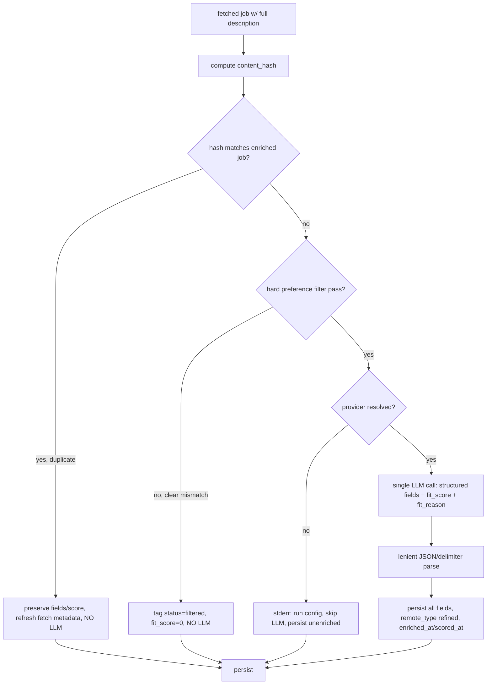
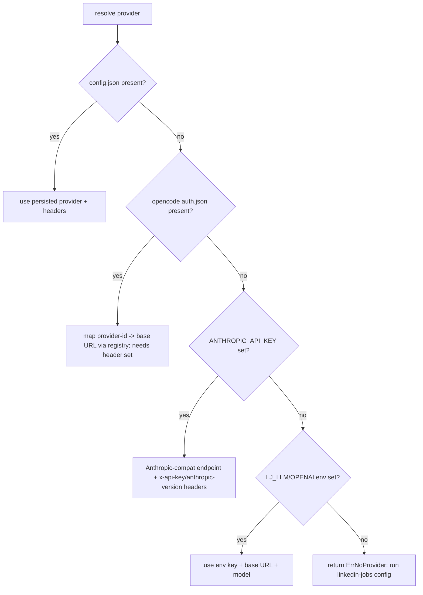

# Job Enrichment, Fit Scoring, and Profile - Plan

## Goal Capsule

- **Objective:** Turn linkedin-jobs from a fetch-and-store tool into a token-aware job-fit engine. Every fetched job is persisted in full, fingerprinted for cheap dedup, hard-filtered against the user's preferences, and — only when it is a genuine new candidate — enriched and fit-scored (0-100) against the user's pasted resume and preferences in a single LLM call. The user configures an LLM provider, pastes a resume and preferences, and gets a ranked, explained shortlist.
- **Authority hierarchy:** User's two rounds of clarification (BYOK OpenAI-compatible path; structured columns; copy-paste resume/preferences into SQLite; save-all-tag-non-matches; configurable stats limit in YAML) are authoritative. Existing codebase patterns (OpenAI-compatible client, `auth.Resolve` priority resolution, `DetectRemote`, SQLite/FTS5 store) are the implementation substrate. The doc-review findings (SearchFTS inline columns, provider base-URL/header gaps, `DetectRemote` already populates `remote_type`) are folded in as resolved constraints.
- **Execution profile:** `code` — additive Go CLI feature; no destructive migration; existing flows keep working.
- **Stop conditions:** All R-IDs met; every unit green against its test scenarios; `go build ./... && go test ./... && go vet ./...` clean; and an end-to-end run on real stored jobs (dedup skips a refetch, a non-matching job is tagged `filtered`, a new candidate gets structured fields + `fit_score` + `fit_reason`) succeeds with a configured provider and pasted resume/preferences.
- **Tail ownership:** The implementing agent (`ce-work` / goal run) owns execution; this plan owns decisions and boundaries.

---

## Product Contract

### Summary

linkedin-jobs today stores jobs and a free-form LLM summary. The user triaging a feed wants the three decisions that matter — company context, stack fit, and location flexibility — plus an actual fit verdict against their own resume and goals, without burning tokens re-processing jobs they have already seen. This plan adds: full-description persistence; LLM-free dedup so repeats are never re-enriched; a pasted resume and preferences profile; a deterministic hard filter that tags clear mismatches without an LLM call; a single combined enrichment + 0-100 fit-scoring call; a rich set of structured columns; configurable stat limits; and an easy copy-paste provider-connect flow.

### Problem Frame

A senior engineer evaluating opportunities reads many postings and repeatedly asks the same questions: what does the company do, what's the stack, is it remote, and — the question the current tool never answers — is this a fit for *me*? The generic summary helps but is unranked, re-runs on every fetch (wasting tokens), and ignores the user's own resume and stated preferences (e.g., "Staff or Founding engineer, early-stage startup, 1-10 people, remote"). There is also setup friction: keys live in env vars even though the user already has a GLM key in opencode and an Anthropic key in the environment. The gap is ranked, explained, token-frugal fit evaluation grounded in the user's own profile.

### Requirements

**Persistence & structured data**

- R1. Entire job description is persisted for every fetched job (no DB truncation; LLM prompts may still cap input for token efficiency).
- R2. Structured columns are persisted and surface in `show`, `--json`, and `export`: `company_overview`, `industry`, `tech_stack`, `seniority`, `employment_type`, `years_experience`, `company_size_band`, `company_stage`, `is_founding_role`, `visa_sponsorship`; the work-arrangement answer writes the existing `remote_type`.

**Dedup (token frugality)**

- R3. Jobs are fingerprinted by normalized company + title + full description (+ post date). A job whose fingerprint matches an already-enriched job is not re-enriched or re-scored — its existing structured fields and score are preserved; only fetch metadata refreshes.

**Profile (resume + preferences)**

- R4. The user can paste resume text and preferences text via CLI commands; both are stored in SQLite. Preferences carry a small structured subset (work arrangement, min salary, locations) used by the hard filter, plus free text used by scoring.

**Filtering**

- R5. A deterministic hard filter tags clear mismatches — remote-required vs on-site, below salary floor, outside preferred locations — as `status=filtered`, `fit_score=0`. Filtered jobs stay stored (for dedup memory and full descriptions) but are excluded from the default `list`.

**Scoring**

- R6. Each non-duplicate, non-filtered job gets a 0-100 `fit_score` computed from its description/requirements plus the user's resume and preferences; a brief `fit_reason` is produced when the score exceeds a configurable threshold (default 70).

**Engine & token efficiency**

- R7. Structured extraction and fit-scoring run in a single OpenAI-compatible LLM call per job (one request, one JSON response with all fields + score + reason). No LLM call is made for duplicate or hard-filtered jobs. BYOK; no provider key ships.

**Provider connect**

- R8. A `config` command lets the user connect a provider by pasting a key (opencode-reuse, Anthropic/Claude, or custom base URL + key + model); the choice persists to a `0600` config file so enrichment/scoring work with no env vars set.

**Configurable stats**

- R9. Top-N stat limits (e.g., top companies) are configurable via a YAML settings file (default 50) and overridable per-invocation via a flag.

**Resilience**

- R10. Missing key or profile, empty description, or unparseable LLM output degrades gracefully — empty fields, a clear stderr message — without crashing.

### Success Criteria

- Re-running `recommended`/`search` over an unchanged feed performs zero LLM calls (all duplicates recognized) and finishes fast.
- A job the user has filtered out by preference (e.g., on-site when remote is required) is tagged `filtered`/score 0 and absent from `list`, but still present with its full description for dedup.
- A new candidate job is enriched with all structured columns and receives a `fit_score` + (when ≥ threshold) a `fit_reason`, all from one LLM call, visible in `show`/`--json`; `list`/`query` can sort or filter by score.
- A first-time user pastes a resume + preferences and a provider key, then sees scored jobs.
- `stats --top 25` and a YAML `top_companies_limit` both change the top-companies count (default 50, was hardcoded 10).

### Scope Boundaries

**In scope**

- Full-description persistence, content-hash dedup, profile (resume/preferences) storage, deterministic hard filter, combined enrich+score LLM call, structured columns, configurable stat limits, provider-connect, pipeline integration, render/export updates.

**Deferred to Follow-Up Work**

- Replacing or removing the existing generic `summarize` command and `llm_summary` field (user: keep exploring). The new enrich+score path runs alongside it.
- PDF/DOCX resume ingestion (user chose copy-paste text only for now).
- Fuzzy near-duplicate detection beyond exact normalized content-hash (minor LinkedIn edits produce a new hash; deferred).
- Replacing the existing env-var LLM config — it remains the lowest-priority resolution source.

**Outside this product's identity**

- Multi-user / cloud sync. This stays a local single-user CLI with a local SQLite DB.
- Scraping or LinkedIn-session changes.

---

## Planning Contract

### Key Technical Decisions

- **KTD1. Reuse the OpenAI-compatible client; provider differences live in a registry, including per-provider headers.** The existing `internal/llm/summarizer.go` already does `POST {base}/chat/completions`. A provider registry maps each provider to `{base URL, key source, default model, extra headers}`. The "extra headers" field is required because Anthropic's OpenAI-compat endpoint needs `x-api-key` + `anthropic-version` that the existing Bearer-only client (`summarizer.go:76`) does not send — the registry carries per-provider headers so presets actually work. No new Go module dependency. The base URL / header contract for the Anthropic and Z.AI/GLM presets must be verified with a real request during U4 (see Q1); the custom-key path works regardless.
- **KTD2. One LLM call per job: structured extraction + fit score in a single JSON response.** The prompt sends the (capped) description plus the user's resume and preferences and requests one JSON object: all structured fields, `fit_score` (0-100), and `fit_reason` (when score ≥ threshold). This is the token-efficiency core (R7) — extraction and scoring share one round-trip and one description read. Parsing is lenient: JSON first, delimiter-format fallback (`Company: … || Stack: … || Score: …`), any missed field becomes empty/`unknown`/0; the call never errors on a parse miss, only on transport failure.
- **KTD3. Token frugality is enforced by ordering: dedup → hard-filter → LLM.** Dedup (content-hash) and the hard filter are deterministic and run before any LLM call, so duplicates and clear mismatches cost zero tokens. The hard filter is restricted to fields available without an LLM — work arrangement (from `DetectRemote`, which already runs at ingest per `scraper.go:152`/`recommended.go:147`), salary floor, and location — because seniority/company-size/founding filtering would require LLM extraction first and would defeat the "no LLM for mismatches" goal. Those richer criteria are expressed through the fit score instead.
- **KTD4. Additive schema; reuse `remote_type`; fix the `SearchFTS` column trap.** New `jobs` columns are added with idempotent `ALTER TABLE … ADD COLUMN` guarded by `PRAGMA table_info`. `remote_type` is reused for work arrangement (it is already populated by `DetectRemote`; enrichment refines it where `DetectRemote` returned unknown — it does not "enable" the filter, which already works). A new `profile` table stores resume/preferences. **Critical:** `SearchFTS` (`internal/store/store.go:244-246`) has its own inline column projection separate from `jobCols`; every column added to `jobCols`/`scanJob` must be added there in lockstep or every search Scan will fail at runtime — U1 owns this.
- **KTD5. Save-all-tag-non-matches, not silent drop.** Every fetched job is persisted (full description + content hash) so dedup remembers it; hard-filter misses are tagged `status=filtered`/`fit_score=0` and excluded from the default `list` (add `--all`/`--include-filtered` to see them). This honors both "save entire descriptions for every position" and "don't treat non-matches as real candidates" without losing dedup memory.
- **KTD6. Provider/profile setup is copy-paste text, no new deps, secrets handled.** Resume and preferences are pasted as text into SQLite. Provider keys are pasted into a `~/.linkedin-jobs/config.json` written `0600`, read via `golang.org/x/term.ReadPassword` (no echo) — or accepted non-interactively from flags/env. Resolution is config-file-first and **non-interactive**: config file → opencode `auth.json` → `ANTHROPIC_API_KEY` → `LJ_LLM_*`/`OPENAI_*` env → return `ErrNoProvider` (the interactive wizard lives only in the `config` command). Unlike `auth.Resolve` (companion-first), provider resolution is config-file-first so an explicit choice sticks.
- **KTD7. Re-scoring is explicit, not automatic on every save.** Scoring runs in the ingest pipeline for new candidates. Re-scoring the whole DB after the user edits their resume/preferences is an explicit `score --all` command (opt-in) — so a profile edit does not silently burn tokens across the whole DB. `tag saved` does **not** auto-enrich by default (scoring already happened at ingest); `enrich`/`score` commands exist for manual re-runs.

### High-Level Technical Design

The ingest pipeline is the spine. Every job flows through five gates; only the last costs an LLM token:

Provider resolution (config-file-first, non-interactive) and profile storage are setup-time concerns that feed the pipeline:

**Sequencing:** U1 (schema/store/model) is the foundation. U2 (settings) and U3 (profile) and U4 (provider) are independent of each other and of U1. U5 (dedup) depends on U1. U6 (hard filter) depends on U1 + U3. U7 (LLM enrich+score) depends on U1 + U3 + U4. U8 (commands + pipeline integration + render) depends on U5, U6, U7. U9 (docs) last.

### Assumptions

- Provider base URLs / header contracts (KTD1): OpenAI `https://api.openai.com/v1` (Bearer, known-good). Anthropic OpenAI-compat (`https://api.anthropic.com/v1`, needs `x-api-key` + `anthropic-version: 2023-06-01`) and Z.AI/GLM base URL — to confirm with a real request during U4 (Q1). If a preset is unavailable it falls through to custom-key; never launch-blocking.
- opencode credential file `~/.local/share/opencode/auth.json` (`{provider-id: {type, key}}`) and config `~/.config/opencode/opencode.json` (carries `model`, not a base URL) are stable for opencode 1.17.x; absence is treated as "opencode not configured", not an error. The provider-id → base-URL mapping is maintained in the registry (a documented drift point).
- `DetectRemote` continues to populate `remote_type` at ingest; enrichment only refines unknowns, so the hard filter has `remote_type` available pre-LLM.

---

## Implementation Units

### U1. Schema, model, store, and migration for the fit engine

- **Goal:** Add all structured/score/dedup columns, the `profile` table, the `filtered` status value, and fix the `SearchFTS` column trap.
- **Requirements:** R1, R2, R5.
- **Dependencies:** none.
- **Files:**
  - `internal/store/store.go` (idempotent `ALTER TABLE … ADD COLUMN` migration guarded by `PRAGMA table_info`; extend `jobCols`, `scanJob`, the inline `SearchFTS` projection at `store.go:244-246`, and `Upsert` COALESCE handling for every new column; new `SetEnrichmentAndScore`, `SetFiltered`, `Profile` get/set methods; `Unenriched`/`Unscored` queries; new `content_hash` index)
  - `internal/models/job.go` (new fields: `CompanyOverview`, `Industry`, `TechStack`, `Seniority`, `EmploymentType`, `YearsExperience`, `CompanySizeBand`, `CompanyStage`, `IsFoundingRole`, `VisaSponsorship`, `FitScore *int`, `FitReason`, `ContentHash`, `EnrichedAt`, `ScoredAt`; existing `RemoteType` reused)
  - `internal/store/store_test.go` (new)
- **Approach:** New `jobs` columns: `company_overview, industry, tech_stack, seniority, employment_type, years_experience, company_size_band, company_stage, is_founding_role, visa_sponsorship, fit_score, fit_reason, content_hash, enriched_at, scored_at` (all nullable/0 by default). `status` gains the literal value `filtered`. New `profile` table (single row): `resume_text, preferences_text, pref_work_arrangement, pref_min_salary, pref_locations, updated_at`. Migration adds missing columns at `Open` time. The `SearchFTS` inline SELECT must be extended by the same columns as `jobCols` (or refactored to reuse it) — this is the review's P1 trap and is non-negotiable. `Upsert` preserves all new columns via COALESCE like the existing `llm_summary`.
- **Patterns to follow:** Existing `Upsert`/`SetLLMSummary`/`scanJob` and the `PRAGMA journal_mode=WAL` + `CREATE TABLE IF NOT EXISTS` setup in `Open`.
- **Test scenarios:**
  - Happy path: insert a job, `SetEnrichmentAndScore` populates structured fields + `fit_score` + `fit_reason` + timestamps; `Get` returns them.
  - Migration idempotency: open a DB created with the old schema, reopen with new code, assert all new columns exist, old rows queryable with empty/new defaults.
  - Covers KTD4. SearchFTS parity: after migration, `SearchFTS` returns a job with all new columns populated (Scan destination count matches) — the regression that would otherwise break every search.
  - Upsert preservation: upsert a job with existing enrichment/score using empty incoming values; stored values preserved.
  - Profile round-trip: `SetProfile`/`GetProfile` store and return resume/preferences including structured preference fields.
  - `SetFiltered`: sets `status=filtered`, `fit_score=0`; `List` default excludes it, `List(--include-filtered)` includes it.
- **Verification:** `go test ./internal/store/...` passes; reopening an existing `linkedin_jobs.db` is non-destructive and search still works.

### U2. YAML settings and configurable stat limits

- **Goal:** Externalize tunable settings to a YAML file; make the hardcoded `LIMIT 10` top-companies query configurable (default 50) with a flag override.
- **Requirements:** R9.
- **Dependencies:** none (parallelizable with U1).
- **Files:**
  - `internal/config/settings.go` (new — load `~/.linkedin-jobs/settings.yaml` with defaults; struct for `stats.top_companies_limit`, `filter.auto_filter`, `scoring.reason_threshold`, `enrich.auto_enrich_on_save`)
  - `internal/config/settings_test.go` (new)
  - `internal/store/store.go` (`Stats`/top-companies query takes a limit parameter instead of hardcoded 10)
  - `cmd/stats.go` (add `--top` flag; default from settings)
  - `go.mod` (add a YAML reader — `gopkg.in/yaml.v3` is the one new dependency this plan introduces; called out because KTD1 otherwise adds none)
- **Approach:** Load settings with defaults at startup; `settings.yaml` is optional (defaults apply if absent). The top-companies SQL `LIMIT ?` is parameterized; `stats` resolves limit as `--top` flag > settings > default(50). `reason_threshold` feeds scoring (U7); `auto_filter` gates the hard filter (U6).
- **Patterns to follow:** Existing `internal/config/config.go` env-resolution style; default-overridable pattern.
- **Test scenarios:**
  - Happy path: a `settings.yaml` with `stats.top_companies_limit: 25` is loaded and `stats` honors 25.
  - Default: no settings file → limit is 50 (not the old 10).
  - Flag override: `--top 5` beats both file and default.
  - Missing file does not error.
- **Verification:** `go test ./internal/config/...` passes; `linkedin-jobs stats --top 25` changes the top-companies count.

### U3. Profile commands (resume + preferences)

- **Goal:** Let the user paste resume and preferences text into SQLite, with a structured preference subset for the hard filter.
- **Requirements:** R4, R5.
- **Dependencies:** U1.
- **Files:**
  - `cmd/profile.go` (new — `profile resume` reads pasted text until EOF/marker; `profile prefs` likewise with optional structured flags `--work remote`, `--min-salary 150k`, `--locations "Toronto,Remote"`; `profile show`; `profile clear`)
  - `internal/store/store.go` (profile get/set from U1)
  - `cmd/profile_test.go` (new)
- **Approach:** Resume and preferences are read from stdin as pasted text (multi-line, terminated by EOF or a sentinel line). Preferences additionally accept structured flags that populate the hard-filter columns (`pref_work_arrangement`, `pref_min_salary`, `pref_locations`) plus a free-text `preferences_text` used by scoring. `profile show` prints resume/preferences with the structured knobs; never prints anything sensitive (these are not secrets, but keep output clean).
- **Patterns to follow:** `cmd/auth.go` subcommand shape; existing `parseMinSalary` for `--min-salary`.
- **Test scenarios:**
  - Happy path resume: pasting text via stdin stores `resume_text`; `profile show` echoes it.
  - Happy path prefs: `profile prefs --work remote --min-salary 200k --locations "Remote,US"` with pasted free-text stores both structured and free-text.
  - Empty profile: scoring/enrichment proceeds without a profile but scores reflect "no resume/preferences" (lower confidence) — does not crash.
  - Re-paste overwrites the single profile row.
- **Verification:** `go test ./cmd/...` passes; pasting a resume then `profile show` round-trips.

### U4. LLM provider config, resolution, and connect command

- **Goal:** Resolve an OpenAI-compatible provider (with per-provider headers) from priority sources; let the user paste a key to persist (`0600`).
- **Requirements:** R7, R8, R10.
- **Dependencies:** none (parallelizable).
- **Files:**
  - `internal/llm/provider.go` (new — `Provider{BaseURL, APIKey, Model, Headers, Source}`, registry with per-provider `{base URL, headers, default model}`, non-interactive resolution, `0600` config load/save, `ErrNoProvider`)
  - `internal/llm/provider_test.go` (new)
  - `cmd/config.go` (new — `config llm` interactive connect: opencode-reuse / Claude / custom; `config show` redacts key; `config path`)
- **Approach:** Resolution order (KTD6): config file → opencode `auth.json` (map provider-id → base URL + headers via registry; read default model from `~/.config/opencode/opencode.json`) → `ANTHROPIC_API_KEY` (Anthropic-compat base URL + `x-api-key`/`anthropic-version` headers) → `LJ_LLM_*`/`OPENAI_*` env → `ErrNoProvider`. Config persisted at `~/.linkedin-jobs/config.json` (`LJ_CONFIG_PATH` override), written `0600` via `os.OpenFile`. The connect wizard reads keys with `golang.org/x/term.ReadPassword` (no echo) when stdin is a TTY, else plain read. **Before implementing the Anthropic/Z.AI presets, verify the base URL + header contract with one real `POST …/chat/completions`** (Q1) and encode the result in the registry's header map.
- **Patterns to follow:** `internal/auth/auth.go` `Resolve` (priority sources + `Source` + typed sentinel — adopt the shape, order differs per KTD6); `cmd/auth.go` subcommand UX.
- **Test scenarios:**
  - Resolution per source: config file → `Source:"config"`; fake opencode `auth.json`+`opencode.json` → mapped base URL/headers, `Source:"opencode"`; `ANTHROPIC_API_KEY` → Anthropic base + required headers, `Source:"anthropic-env"`; `OPENAI_API_KEY` → OpenAI base, `Source:"env"`.
  - Unconfigured returns `ErrNoProvider` naming `linkedin-jobs config`.
  - Config file written `0600` (assert file mode).
  - Save round-trip reproduces base URL/key/model/headers.
  - `config show` never prints the full key.
- **Verification:** `go test ./internal/llm/...` passes; a real `linkedin-jobs config llm` (custom key) then `enrich` works with no env vars; `stat` shows config file mode `0600`.

### U5. Content-hash dedup

- **Goal:** Fingerprint every job so re-fetched duplicates are recognized without an LLM call.
- **Requirements:** R3, R7.
- **Dependencies:** U1.
- **Files:**
  - `internal/store/dedup.go` (new — `ContentHash(company, title, description, listedAt)` normalization + SHA-256; `IsDuplicate(hash)` lookup)
  - `internal/store/dedup_test.go` (new)
  - `cmd/pipeline.go` (ingest computes hash; if duplicate of an enriched job, skip LLM and refresh only fetch metadata)
- **Approach:** Normalize (lowercase, collapse whitespace, strip HTML, trim) company + title + full description; incorporate `listed_at`. SHA-256 → `content_hash`, stored and indexed. On ingest, if `content_hash` matches a job that already has `enriched_at`, treat as duplicate: preserve all structured/score fields, update `searched_at`/`fetched_at`, emit no LLM call. Minor LinkedIn edits produce a different hash (fuzzy near-dup is deferred — Scope).
- **Patterns to follow:** Existing `Upsert` preservation semantics; `strings` normalization.
- **Test scenarios:**
  - Same job re-fetched: identical hash → `IsDuplicate` true; ingest skips LLM; existing score preserved.
  - Whitespace/HTML/case differences normalize to the same hash.
  - Genuinely different job → different hash → not a duplicate.
  - Duplicate of an *unenriched* job (no `enriched_at`): still treated as seen, not re-fetched for details redundantly.
- **Verification:** `go test ./internal/store/...` passes; re-running `recommended` over an unchanged feed issues zero LLM calls.

### U6. Hard preference filter

- **Goal:** Deterministically tag clear mismatches without an LLM call.
- **Requirements:** R5.
- **Dependencies:** U1, U3.
- **Files:**
  - `internal/filter/filter.go` (new — `HardFilter(job, profile, settings) bool` using pre-LLM fields only: `remote_type`/location vs `pref_work_arrangement`/`pref_locations`; `salary_high` vs `pref_min_salary`)
  - `internal/filter/filter_test.go` (new)
  - `cmd/pipeline.go` (run hard filter after dedup; misses → `SetFiltered`)
  - `cmd/list.go` (default excludes `status=filtered`; add `--include-filtered`/`--all`)
- **Approach:** Uses only fields available pre-LLM (KTD3): work arrangement from `DetectRemote`'s `remote_type`/location, salary floor, preferred locations. If the user requires remote and the job is on-site → mismatch; below salary floor → mismatch; outside preferred locations → mismatch. Misses are tagged `status=filtered`, `fit_score=0` via `SetFiltered` and excluded from default `list`. Richer criteria (seniority, company stage, founding role) are intentionally NOT here — they need LLM extraction and are expressed via `fit_score`. Gated by `settings.filter.auto_filter` (default true).
- **Patterns to follow:** Existing `filterJobs` in `cmd/pipeline.go`; `strings.Contains` remote check.
- **Test scenarios:**
  - Covers R5. Remote-required vs on-site job → filtered (score 0), excluded from default list.
  - Below `pref_min_salary` → filtered.
  - Remote-required + remote job → passes (not filtered).
  - No profile set → nothing filtered (filter is a no-op without preferences).
  - `auto_filter=false` → no filtering even with a profile.
  - `--include-filtered` shows filtered jobs.
- **Verification:** `go test ./internal/filter/...` passes; an on-site job with a remote-required profile is tagged `filtered` and absent from `list`.

### U7. Combined LLM enrichment + fit scoring

- **Goal:** Produce all structured columns + `fit_score` + `fit_reason` in one OpenAI-compatible call, grounded in the user's resume and preferences.
- **Requirements:** R2, R6, R7, R10.
- **Dependencies:** U1, U3, U4.
- **Files:**
  - `internal/llm/scorer.go` (new — `Score(j, profile, provider, reasonThreshold) (Result, error)`; structured prompt requesting one JSON object; lenient JSON/delimiter parse)
  - `internal/llm/scorer_test.go` (new — `httptest` servers, no real key)
- **Approach:** Reuse the HTTP request shape from `summarizer.go` plus the provider's headers (U4). Prompt sends capped description + resume_text + preferences_text and requests one JSON object: all structured fields + `fit_score`(0-100) + `fit_reason`(only if score ≥ `reason_threshold`, default 70). Parse JSON; on failure, parse a delimiter format (`Company: … || Industry: … || Stack: … || Seniority: … || Remote: … || Score: NN || Reason: …`); any miss → empty/`unknown`/0, never an error. Normalize enums (case-insensitive; "on-site"→`onsite`). Empty description → zero `Result`, no HTTP call. Transport failure → error (caller warns, persists unenriched). Truncate error bodies to ≤256 bytes when bubbling (avoids logging a reflected token/PII — review finding).
- **Patterns to follow:** `internal/llm/summarizer.go` (`llmSummarize` request construction, `orNA`, description cap).
- **Test scenarios:**
  - Happy path JSON: valid JSON yields all fields + score + reason; enums normalized.
  - Delimiter fallback: non-JSON delimiter response still extracts fields.
  - Unstructured prose (no labels): result degrades to mostly-empty fields without error; document that such providers yield weak coverage.
  - Score below threshold → empty `fit_reason`; above → reason present.
  - Empty description → no HTTP call, zero result.
  - Transport 500 → error, caller persists unenriched and continues.
- **Verification:** `go test ./internal/llm/...` passes via `httptest`.

### U8. Command surface, pipeline integration, and render/export

- **Goal:** Wire dedup + filter + score into the ingest pipeline; expose commands; surface all new fields and scores in output.
- **Requirements:** R1–R7, R10.
- **Dependencies:** U5, U6, U7.
- **Files:**
  - `cmd/enrich.go` (new — `enrich <id>`, `enrich --all`/`score --all` re-run scoring with current profile; `--include-filtered`)
  - `cmd/score.go` (new — alias/variant focused on re-scoring after profile edits)
  - `cmd/pipeline.go` (integrate the five-gate flow: hash → dedup → hard-filter → score → persist; `--no-score`/`--no-filter` escape hatches)
  - `internal/render/render.go` (`Detail` shows structured fields + `fit_score`/`fit_reason`; `Table` gains a Score column and can sort by score; default list excludes `filtered`)
  - `cmd/export.go` (emit all new columns in CSV/Markdown/JSON)
  - `cmd/list.go`/`cmd/query.go` (score sort/filter; `--min-score`, `--include-filtered`)
  - `cmd/tag.go` (no auto-enrich by default — KTD7; optional `--score` to re-score on tag)
  - `cmd/enrich_test.go` (new)
- **Approach:** The shared ingest flow (U5→U6→U7) is the default for `recommended`/`search`; `--no-score` skips the LLM, `--no-filter` skips the hard filter. `enrich`/`score` commands re-run the LLM call (single or `--all`) using the current profile — the way to refresh scores after editing resume/preferences. Render sorts/lists by score so the shortlist surfaces first. `--json` automatically includes new model fields.
- **Patterns to follow:** `cmd/summarize.go` (batch loop, per-job error continuation); `cmd/pipeline.go` (`ingest`/`filterJobs`).
- **Test scenarios:**
  - End-to-end ingest: duplicate → no LLM; mismatch → filtered/score 0; new candidate → enriched + scored, all in the right gate order.
  - `score --all` after a profile edit re-scores existing non-filtered jobs.
  - `list --min-score 70` returns only high-fit jobs.
  - `--no-score` ingest persists jobs unenriched.
  - `show <id>` displays structured fields + score + reason; `--json` includes them.
  - Export CSV contains the new columns.
- **Verification:** `go test ./cmd/...` passes; an end-to-end run on real stored jobs exercises all five gates.

### U9. Documentation

- **Goal:** Document the fit-engine workflow end to end.
- **Requirements:** all (usability).
- **Dependencies:** U8.
- **Files:**
  - `README.md` (new sections: Profile (paste resume/preferences), Provider connect, Scoring & filtering (how dedup/hard-filter/score interact, how to be token-frugal), Configurable settings (settings.yaml + `--top`), the new structured fields, and the `filtered` status / `--include-filtered`)
- **Approach:** Lead with the user's first-run path: `config llm` → `profile resume` → `profile prefs` → `recommended`. Explain the token-frugality model (dedup and hard filter are free; scoring is one call per new candidate). Document `settings.yaml` keys and defaults.
- **Test scenarios:** `Test expectation: none — documentation only.`
- **Verification:** README accurately reflects the shipped commands and defaults.

---

## Verification Contract

| Check | Command | Applies to |
|---|---|---|
| Build | `go build ./...` | all units |
| Vet | `go vet ./...` | all units |
| Unit tests | `go test ./...` | U1–U8 |
| Store/migration (incl. SearchFTS parity) | `go test ./internal/store/...` | U1, U5 |
| Settings | `go test ./internal/config/...` | U2 |
| Provider/scorer (httptest) | `go test ./internal/llm/...` | U4, U7 |
| Filter | `go test ./internal/filter/...` | U6 |
| Commands | `go test ./cmd/...` | U3, U8 |
| End-to-end (manual) | configure provider (`config llm`), paste resume/preferences, run `recommended`, then confirm: a refetch makes zero LLM calls, an on-site/remote-required job is `filtered`, a new candidate has structured fields + `fit_score` + (`fit_reason` if ≥70), `stats --top 25` changes top-companies | U1–U8 |

The repo uses the Go toolchain (`go 1.26`, no Makefile). Tests are `*_test.go` alongside packages (convention: `internal/auth/auth_test.go`, `internal/linkedin/recommended_test.go`). `cmd/helpers.go`'s `newCmd` exists to stub subprocesses in tests. This plan introduces exactly one new dependency — `gopkg.in/yaml.v3` (U2) — and `golang.org/x/term` (already transitively available via the Go toolchain's vendored tree; confirm availability) for no-echo key read.

---

## Definition of Done

**Global**

- All R-IDs (R1–R10) are met and traceable to units/test scenarios.
- `go build ./... && go test ./... && go vet ./...` is clean.
- An existing `linkedin_jobs.db` reopened after these changes has intact prior data and all new columns; `SearchFTS` still works (the inline-column trap is fixed).
- README documents profile, provider-connect, scoring/filtering, token-frugality, and configurable settings.
- No abandoned/experimental code in the diff.

**Per-unit**

- U1: all columns + `profile` table exist and persist; `SearchFTS` parity verified; migration idempotent on old DBs.
- U2: top-companies limit = 50 default, YAML + `--top` override work.
- U3: resume/preferences paste round-trips; structured preference knobs stored.
- U4: resolution returns correct `Source`/headers per path; config file `0600`; `ErrNoProvider` actionable; Anthropic/Z.AI presets verified or marked fallback.
- U5: re-fetch of an unchanged job → zero LLM calls; hash normalization stable.
- U6: clear mismatches tagged `filtered`/score 0 and excluded from default list.
- U7: one call yields fields + score + reason; lenient parse never errors on a miss; error bodies truncated.
- U8: ingest runs all five gates in order; `score --all` re-scores; render/export/sort reflect new fields.
- U9: README first-run path and token-frugality model are accurate.

---

## Risks & Dependencies

- **Provider base-URL / header contract (KTD1, Q1).** Anthropic's `x-api-key`/`anthropic-version` requirement and the Z.AI/GLM base URL must be verified with a real request. Mitigation: per-provider header map in the registry; custom-key path always works; a wrong preset surfaces as a clear HTTP error.
- **LLM output variance across BYOK providers (KTD2).** Smaller models (e.g., some GLM tiers) may return unstructured prose, yielding weak field coverage. Mitigation: delimiter-format fallback; the feature degrades to sparse fields rather than failing; document provider compatibility expectations.
- **Dedup false negatives (KTD5, Scope).** Minor LinkedIn description edits change the hash, so a lightly-edited re-post is treated as new and re-scored. Mitigation: accepted; fuzzy near-dup deferred. Net token cost is bounded because each new hash is scored once.
- **`SearchFTS` column drift (KTD4).** Adding columns without updating the inline projection breaks all search. Mitigation: U1 owns both and includes a parity regression test.
- **Score subjectivity.** Fit scores are LLM judgments, not ground truth. Mitigation: always show `fit_reason`; frame scoring as a ranking aid, not a verdict; threshold configurable.

---

## Open Questions

- **Q1 (deferred, implementation-time).** Exact OpenAI-compatible base URLs and required headers for the Anthropic and Z.AI/GLM presets. Verify with one real request during U4; if unavailable, the preset maps users to the custom flow. Non-blocking: custom preset is the always-available fallback.
- **Q2 (deferred).** Whether to fold the existing generic `summarize`/`llm_summary` into the new enrich+score path later (user: keep exploring, don't replace yet).

---

## System-Wide Impact

- **Data lifecycle:** Additive `jobs` columns + a new `profile` table; no existing column changes type. `remote_type` gains enrichment as a second writer (refining `DetectRemote` unknowns). `status` gains the `filtered` value. Every fetched job is now persisted (save-all), increasing DB growth — offset by content-hash dedup preventing redundant processing.
- **Token/cost posture:** The dedup → hard-filter → LLM ordering makes the common case (re-fetches, mismatches) free; LLM cost is one call per genuine new candidate. Re-scoring the whole DB is opt-in (`score --all`), not automatic on profile edits.
- **Configuration surface:** New persisted `config.json` (provider, `0600`) + `settings.yaml` (tunables) + `profile` table (resume/preferences) + a `config`/`profile` command tree. Existing env-var config remains the lowest-priority provider source; current users are unaffected.
- **Agent-native parity:** `--json` gains structured fields + `fit_score`; lists/sorts are score-aware; enrichment/scoring commands support `--json`.
- **Trust:** Job descriptions and the user's resume/preferences are sent to a user-chosen LLM endpoint. This is an accepted BYOK trade-off (R7); the README names it. Resume/preferences are not secrets but are personal data; config keys are the only secret at rest (`0600`).

---

## Sources & Research

- `internal/llm/summarizer.go` — proven OpenAI-compatible `/chat/completions` client reused by KTD1/U7; note its Bearer-only auth (`summarizer.go:76`) and full-body error logging (`summarizer.go:85`) — both addressed (per-provider headers; truncated error bodies).
- `internal/auth/auth.go` — `Resolve` multi-source pattern adopted (KTD6); order intentionally differs (config-file-first).
- `internal/store/store.go` — schema, `Upsert` COALESCE, `SetLLMSummary`, `Unsummarized`, and the **inline `SearchFTS` projection at `store.go:244-246`** (KTD4 trap) extended by U1.
- `internal/linkedin/scraper.go:152` and `internal/linkedin/recommended.go:147` — `DetectRemote` already populates `remote_type` at ingest, grounding KTD3's claim that the hard filter has work-arrangement data pre-LLM and reframing enrichment as refinement (not enabling) of the remote filter.
- `cmd/pipeline.go`, `cmd/summarize.go`, `cmd/tag.go`, `cmd/auth.go` — ingest/filter, batch, single-update, and onboarding UX patterns.
- opencode v1.17.11 local inspection: `~/.local/share/opencode/auth.json` shape `{provider-id: {type, key}}` and `~/.config/opencode/opencode.json` (carries `model`, **no base URL**) — grounds KTD1's provider-id → base-URL registry requirement and the "connect opencode" preset.
