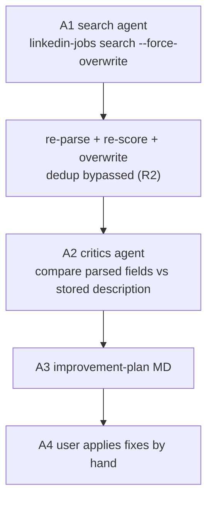
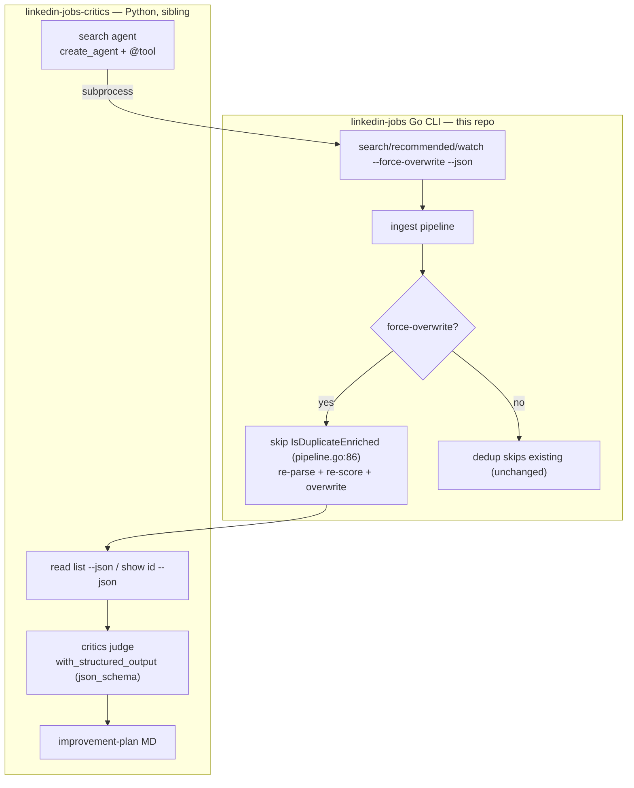

# Critics Agent - Plan

## Goal Capsule

- **Objective:** A one-shot langchain critics workflow that wraps the `linkedin-jobs` Go CLI, force-refreshes parsing and scoring for fetched jobs, compares each job's parsed fields against its stored full description, and writes a human-actionable improvement-plan MD of parsing defects for the user to fix by hand.
- **Product authority:** The user's dialogue choices are authoritative — one-shot (no loop, no coding agent, no rebuild), parsed-fields-only inspection (salary, location, remote_type, title, company), force-overwrite via a new Go CLI flag with normal CLI dedup unchanged, fixes applied by hand, and plain langchain over LangGraph. The existing codebase (content-hash dedup, stored full description, global `--json`, salary card-field sourcing) is the substrate.
- **Execution profile:** `code` — a net-new Python/langchain system plus one additive Go CLI flag; no destructive change; existing CLI flows keep working.
- **Open blockers:** None — Q1–Q4 are resolved/deferred per the Planning Contract below.
- **Product Contract:** unchanged — enriched in place to `implementation-ready`. R1–R6, Actors, Flows, Scope, and product Key Decisions (KD1–KD5) are preserved as finalized in `ce-brainstorm`; this pass adds the HOW (Planning Contract, Implementation Units, Verification, DoD).

---

## Product Contract

### Summary

A one-shot langchain critics workflow around the existing `linkedin-jobs` Go CLI. A search agent pulls jobs with a new force-overwrite flag that bypasses dedup and re-runs the full parse + score pipeline, overwriting existing rows; a critics agent then compares each job's stored parsed fields against its full description and writes an improvement-plan MD of findings and suggested fixes. No loop and no coding agent — the user takes the plan and applies the fixes by hand.

### Problem Frame

The CLI's parsed fields occasionally disagree with the job description they came from. The concrete case that motivated this: a Nubank "Senior Software Engineer" posting stored `CAD$100,000 – $180,000` while the description body states a precise base salary of `$147,996 - $185,004`. The salary parser itself is sound; the defect is that salary is sourced from the detail page's rounded card band (`internal/linkedin/scraper.go:108-122`) rather than the description, so the wrong figure is stored. A second latent class: the salary range splitter requires whitespace, so `100k-200k` would not split where `100k - 200k` would (`internal/salary/salary.go:46`).

These defects are silent. They warp salary filtering and any downstream fit signal, and the user has no way to notice them without manually re-reading each description against the stored fields. Worse, re-examining stored jobs is blocked by design: content-hash dedup (R3 of the enrichment plan) intentionally skips re-processing jobs already in the DB, so the CLI as it stands cannot be pointed at existing rows to refresh and re-check their parsing. The gap is an automated pass that forces a fresh parse and judges it against the description — then hands the defects to a human as an actionable list.

### Requirements

**Search & overwrite**

- R1. A search agent triggers the CLI's search to fetch jobs into the DB.
- R2. The CLI gains a force-overwrite flag that bypasses content-hash dedup and re-runs the full parse + score pipeline for every fetched job, overwriting existing stored values; without the flag, the current dedup-skip behavior is unchanged.

**Critics inspection**

- R3. The critics inspects parsed fields only: salary, location, remote_type, title, company.
- R4. The critics judges each parsed field against the job's stored full description (the ground truth) and flags any mismatch.

**Improvement-plan output**

- R5. Findings are written to an improvement-plan MD; each finding names the job, the field, the stored value, a quote from the description as evidence, and the source location of the parsed value as the suggested fix target.
- R6. A run that finds no discrepancies produces a clear "no issues" result rather than an empty or ambiguous file.

### Key Decisions

- **KD1. One-shot, no loop.** The workflow runs once: search → critics → improvement MD, then terminates. There is no verification loop, no coding agent, and no rebuild step; the user applies fixes by hand from the MD.
- **KD2. Force-overwrite is a CLI flag, not Python-side clear-and-refetch.** A new Go CLI flag (R2) is the clean way to bypass dedup and force re-parse + re-score + overwrite. Normal CLI use is untouched.
- **KD3. Parsed fields only in v1.** Inspection covers salary, location, remote_type, title, company. LLM-enriched structured-field quality and fit-score review are deferred — "correctness" there is too fuzzy to judge deterministically against the description.
- **KD4. The critics is an LLM judge against the stored description.** The stored full description is the ground truth; the critics does not re-fetch from LinkedIn to decide correctness, it compares the stored parsed value against the stored description text.
- **KD5. Plain langchain, not LangGraph.** With no loop, a state graph's conditional edges and human-gate interrupts are unjustified machinery. Langchain provides the LLM calls and the search-invoking tool; a plain Python sequence drives the one-shot pass.

### Actors

- A1. Search agent — invokes the CLI search with the force-overwrite flag to populate/refresh the DB.
- A2. Critics agent — the LLM judge; compares stored parsed fields against the stored description and emits findings.
- A3. Improvement-plan maker — writes the findings MD. (May be the same agent as A2; the user named "critics and improvement plan maker" as two roles.)
- A4. The user — applies the fixes from the MD by hand; there is no automated coding agent.
- A5. The `linkedin-jobs` Go CLI — the system being improved; provides search, `--json` output, and the new force-overwrite flag.

### Key Flows

- F1. Critics workflow (one-shot)
  - **Trigger:** The user runs the critics workflow with search keywords/location.
  - **Actors:** A1, A2, A3, A4, A5.
  - **Steps:** A1 runs `linkedin-jobs search` with the force-overwrite flag (R2), so every fetched job is re-parsed + re-scored + overwritten with dedup bypassed; A2 reads each stored job (via `--json`) and judges its parsed fields against the stored description; A3 writes the improvement-plan MD.
  - **Outcome:** An improvement-plan MD (or a "no issues" result) is produced and the workflow terminates. Fixes are applied by hand by A4.

### Acceptance Examples

- AE1. **Covers R2.** Given a job already in the DB, when search runs with the force-overwrite flag, then the job is re-parsed + re-scored and its stored values are overwritten (dedup bypassed).
- AE2. **Covers R2.** Given a job already in the DB, when search runs without the flag, then dedup skips re-processing and existing values are preserved (unchanged behavior).
- AE3. **Covers R3, R4, R5.** Given a job whose stored salary (from the card band) differs from the base salary stated in the description, when the critics inspects it, then a finding is written naming the job, the stored salary, a quote of the description's salary line as evidence, and the salary source location as the fix target.
- AE4. **Covers R6.** Given a run where every inspected field matches its description, when the critics completes, then a single "no issues" result is produced instead of an empty MD.

### Success Criteria

- The improvement MD is actionable by a human without further investigation: every finding carries its evidence quote and fix target.
- Normal CLI behavior (dedup, scoring, filtering) is byte-for-byte unchanged when the force-overwrite flag is absent.
- The workflow runs end-to-end and terminates after writing the MD — it never loops or waits on a rebuild.

### Scope Boundaries

**Deferred for later**

- LLM-enriched structured-field quality (seniority, tech stack, employment type, etc.) and fit-score / fit-reason review — correctness there is too fuzzy for v1.
- Closed-loop verification (re-parse after a fix to prove it resolved the defect) — would require the loop this feature deliberately omits.

**Outside this product's identity**

- An autonomous coding agent that edits the Go CLI. Fixes are applied by the user by hand.
- Any change to normal CLI dedup, scoring, or filtering behavior outside the force-overwrite flag.

### Dependencies / Assumptions

- The Go CLI gains the force-overwrite flag (R2) — the only Go-side work; everything else is the net-new Python system. Build/test contract: `go build ./... && go test ./... && go vet ./...`; there is no CI, so the user verifies locally.
- The full job description is already persisted — column `description TEXT` (`internal/store/store.go:24`), sourced from JSON-LD `JobPosting.description` (`internal/linkedin/scraper.go:142-148`). No schema change needed for the critics to read it.
- `--json` is already a global persistent flag (`cmd/root.go:49`) on `show`, `list`, and `query`, so the critics reads stored jobs as structured JSON without new CLI surface.
- Salary is sourced from the detail-page card field `.main-job-card__salary-info` (`internal/linkedin/scraper.go:108-122`), not JSON-LD — this is why Nubank-class defects are wrong-source problems and why R5's fix target points at sourcing, not parsing arithmetic.
- The critics needs an LLM provider (BYOK), reusing the same OpenAI-compatible posture the CLI already uses for enrichment.

### Outstanding Questions

**Deferred to planning**

- Q1. Where does the Python/langchain project live — a sibling directory to the Go repo, a subdir, or a separate repo? The choice affects packaging and how the workflow invokes the Go binary.
- Q2. What is the improvement-MD's exact structure beyond the per-finding fields in R5 (e.g., summary header, severity, grouping by field vs by job)?
- Q3. langchain version, and whether the critics judges jobs in a single LLM call per job or in batches.
- Q4. How the search agent takes keywords/location — hardcoded config for the workflow vs. CLI args passed through.

### Sources / Research

- Salary is sourced from the detail-page card `.main-job-card__salary-info` — `internal/linkedin/scraper.go:108-122` (not JSON-LD, not the list/search card). Root cause of the Nubank wrong-source defect class.
- Full description persisted from JSON-LD `JobPosting.description` — `internal/linkedin/scraper.go:142-148`; column `description TEXT` at `internal/store/store.go:24`.
- `--json` is a global persistent flag — `cmd/root.go:49`; consumed by `show`/`list`/`query` and the shared `ingest` path used by `search` (`cmd/search.go:64` → `cmd/pipeline.go`).
- Salary parser handles `CA$`/`C$`/`CAD`/`US$`/`USD`/`$` and `k`/`M` units; the range splitter requires whitespace, so `100k-200k` will not split where `100k - 200k` will — `internal/salary/salary.go:39,46`. A second defect class the critics could surface.
- Repo is pure Go (`go 1.26`); no Python, no Makefile, no CI — the langchain system is net-new. Remote `github.com/paputechxyz/linkedin-job-cli`, branch `pxlxinzhao/critics`.
- `docs/plans/2026-06-28-001-feat-structured-job-enrichment-plan.md` covers structured enrichment + fit scoring. It is complementary: that plan adds the parsed/enriched fields; this critics validates parse correctness against the description, not enrichment quality.

---

## Planning Contract

### Key Technical Decisions

- **KTD1. Force-overwrite bypasses exactly one gate: the dedup-skip at `cmd/pipeline.go:86`.** `st.IsDuplicateEnriched(j.ContentHash)` currently skips any job whose hash is already enriched. The flag makes that check conditional (`!opts.forceOverwrite && ...`). Re-fetch already refreshes salary + description in pipeline step 1 (`FetchDetailsBatch`), and `SetEnrichmentAndScore` already overwrites in place — so no new overwrite logic is required; the dedup gate was the only barrier. This is the entire Go-side change.
- **KTD2. langchain 1.3.x: `create_agent` + `@tool` for the search step; `with_structured_output(method="json_schema")` for the critics judge.** The user asked for a "search agent," so the search step uses `create_agent` with a single `@tool` that shells to the CLI — a first-class `create_agent` use case that does not require a LangGraph import. The critics judge has no tools, so it uses `ChatOpenAI.with_structured_output(CritiqueReport, method="json_schema")` for provider-enforced structured output (more reliable than `PydanticOutputParser`). Legacy `AgentExecutor`/`create_tool_calling_agent`/`initialize_agent` are avoided. Pin `langchain>=1.3`, `langchain-openai>=1.3`.
- **KTD3. The critics reuses the Go CLI's provider config as the single source of truth for the LLM key.** An adapter reads base URL + key + model from `~/.linkedin-jobs/config.json` and constructs `ChatOpenAI(base_url=..., api_key=..., model=...)`, falling back to `OPENAI_API_KEY` / `LJ_LLM_*` env. One key store, no second provider setup. (`ChatOpenAI` targets the OpenAI Chat Completions spec; provider-specific response extensions like `reasoning_content` are not preserved — acceptable for this judge workload.)
- **KTD4. The critics reads jobs as structured JSON via the existing global `--json` flag — no new CLI read surface.** `list --json` enumerates jobs; each job's stored parsed fields and full description are already in that payload (`description`, `salary_*`, `location`, `remote_type`, `title`, `company`). The judge iterates jobs and compares parsed fields against the description in one structured call per job.
- **KTD5. Separate Python project (`linkedin-jobs-critics/`, sibling to this repo).** Clean stack separation — this repo stays pure Go with no Python tooling mixed in. The workflow invokes the built `linkedin-jobs` binary from `PATH` (overridable via `LJ_BIN_PATH`). The Go change (U1) lands in this repo regardless; the langchain system (U2–U6) lives in the sibling project.

### High-Level Technical Design

The workflow is two processes cooperating: a Go CLI that owns fetching/parsing/scoring/persistence, and a Python orchestrator that drives a search, reads the results as JSON, judges parse correctness, and writes a report. They meet at two seams — the `--force-overwrite` flag and the `--json` output.

**Sequencing:** U1 (Go flag) and U2 (Python scaffold) are independent. U3 (search agent) and U4 (judge) depend on U2. U5 (report) depends on U4's `Finding` model. U6 (orchestration + docs) depends on U3, U4, U5. U3 is testable with a mocked CLI before U1 lands; U1 must be merged and the binary built before an end-to-end run can exercise real force-overwrite.

### Assumptions

- The built `linkedin-jobs` binary is on `PATH` when the workflow runs (or `LJ_BIN_PATH` points at it).
- An LLM provider is configured via the Go CLI's `~/.linkedin-jobs/config.json` or `OPENAI_API_KEY` / `LJ_LLM_*` env; the critics reuses it (KTD3).
- langchain 1.3.x and langchain-openai 1.3.x are current as of 2026; `create_agent` and `with_structured_output` are the current idiomatic APIs per official docs. If a future langchain major revokes either, U3/U4 update to the successor API.
- The salary wrong-source defect class (Nubank): the judge compares the stored salary against the description and the suggested fix points at the salary source (`internal/linkedin/scraper.go:108`), consistent with the confirmed root cause.
- No CI exists; verification is local (`go test` for U1, `pytest` for U2–U6).

---

## Implementation Units

### U1. Go CLI — `--force-overwrite` flag (this repo)

- **Goal:** Add a flag that bypasses dedup so already-stored jobs are re-parsed + re-scored + overwritten (R2).
- **Requirements:** R2.
- **Dependencies:** none.
- **Files:**
  - `cmd/pipeline.go` (add `forceOverwrite bool` to `ingestOptions`; change the dedup guard at line 86 to `if !opts.forceOverwrite && st.IsDuplicateEnriched(j.ContentHash)`; thread `opts.forceOverwrite` into `ingest`)
  - `cmd/search.go`, `cmd/recommended.go`, `cmd/watch.go` (add a `--force-overwrite` bool flag; pass it into the `ingestOptions` at each `ingest(...)` call site)
- **Approach:** The flag is purely a bypass of the dedup-skip gate. Because `FetchDetailsBatch` already re-fetches salary + description for every job and `SetEnrichmentAndScore` already overwrites, skipping the gate is sufficient to force full re-processing. Normal CLI behavior (no flag) is untouched. Surface the flag in each command's `--help`.
- **Patterns to follow:** Existing flag-threading into `ingestOptions` (see how `noScore`/`noFilter` are declared in `cmd/search.go` and consumed in `cmd/pipeline.go`).
- **Test scenarios:**
  - Covers R2 / AE1: with the flag, a job already enriched is re-scored (dedup not skipping); `enriched_at`/`scored_at` advance.
  - Covers R2 / AE2: without the flag, dedup skips an already-enriched job (unchanged).
  - Overwrite: a job whose stored salary changed between runs is updated to the fresh value when the flag is set.
  - Other gates unaffected: the hard filter still runs (unless `--no-filter`); `--no-detail` still skips the fetch.
- **Verification:** `go test ./cmd/...` passes; `go build ./... && go vet ./...` clean.

### U2. Python project scaffold + provider config adapter (`linkedin-jobs-critics/`)

- **Goal:** Stand up the langchain project and an adapter that builds a `ChatOpenAI` from the Go CLI's provider config (KTD3).
- **Requirements:** supports R1–R6 (infrastructure).
- **Dependencies:** none (parallelizable with U1).
- **Files:** (project root: `linkedin-jobs-critics/`, new, sibling to this repo)
  - `linkedin-jobs-critics/pyproject.toml` (`langchain>=1.3`, `langchain-openai>=1.3`, `pydantic>=2`; `[project.scripts] critics = "critics.cli:main"`; uv-managed)
  - `linkedin-jobs-critics/src/critics/__init__.py`
  - `linkedin-jobs-critics/src/critics/config.py` (`load_llm()` — read `~/.linkedin-jobs/config.json` for base URL + key + model, else `OPENAI_API_KEY`/`LJ_LLM_*` env, else raise an actionable error; return a `ChatOpenAI` instance)
  - `linkedin-jobs-critics/src/critics/cli.py` (entry point skeleton; full orchestration lands in U6)
- **Approach:** uv-managed project per langchain docs. The config adapter is the only bridge to the Go CLI's key store; it resolves in priority order matching the CLI's own resolution and constructs `ChatOpenAI(base_url=..., api_key=..., model=...)`. No `.env`/second key store.
- **Patterns to follow:** langchain integration doc for `ChatOpenAI` `base_url`/env resolution; `~/.linkedin-jobs/config.json` shape from the enrichment plan (KTD6 there).
- **Test scenarios:**
  - Adapter resolves a `ChatOpenAI` from a fake `config.json`.
  - Adapter falls back to `OPENAI_API_KEY`/`LJ_LLM_BASE_URL` env when no config file.
  - Neither present → raises an error naming `linkedin-jobs config llm`.
- **Verification:** `pytest` passes; `critics --help` runs.

### U3. Search agent + CLI subprocess tool

- **Goal:** A langchain `create_agent` with one `@tool` that runs `linkedin-jobs search … --force-overwrite --json` to populate/refresh the DB (R1).
- **Requirements:** R1.
- **Dependencies:** U2.
- **Files:**
  - `linkedin-jobs-critics/src/critics/tools.py` (`linkedin_jobs_search` `@tool` — argv-list `subprocess.run` with `timeout`, UTF-8 `text`, parse stdout JSON, return a compact `{count, ids}` string; on non-zero exit / timeout / non-JSON, return a short error string — never raise)
  - `linkedin-jobs-critics/src/critics/search_agent.py` (`build_search_agent(llm)` — `create_agent(model=llm, tools=[linkedin_jobs_search], system_prompt=...)`)
- **Approach:** The tool's docstring is the model's tool description (state what it does, returns, and when to use). Use the argv-list form (no `shell=True`) to avoid injection. Truncate large output to counts/IDs so the model context stays small. Resolve the binary via `LJ_BIN_PATH` or `PATH`. Because the search is essentially one deterministic call, the agent's job is to formulate keywords/location from the user's args and invoke the tool once.
- **Patterns to follow:** langchain `create_agent` + `@tool` how-to; subprocess best practice (list form, timeout, capture, never raise inside a tool).
- **Test scenarios:**
  - Tool runs the CLI, parses JSON, returns a count + IDs summary.
  - CLI exits non-zero → tool returns an error string (no exception); agent can read it.
  - Timeout → tool returns a timeout error string.
  - Non-JSON stdout → tool returns a parse-error string with a short head.
- **Verification:** `pytest` passes (mock `subprocess.run`).

### U4. Critics judge (structured-output LLM)

- **Goal:** An LLM judge that compares each job's parsed fields against its stored description and emits structured findings (R3, R4).
- **Requirements:** R3, R4.
- **Dependencies:** U2.
- **Files:**
  - `linkedin-jobs-critics/src/critics/judge.py` (pydantic `Finding{field, stored_value, evidence_quote, is_consistent, suggested_fix}` and `CritiqueReport{job_id, findings}`; `judge_job(job, llm)` builds the prompt over the parsed fields salary/location/remote_type/title/company vs the description and calls `llm.with_structured_output(CritiqueReport, method="json_schema")`)
  - `linkedin-jobs-critics/src/critics/tools.py` (add `linkedin_jobs_list` and `linkedin_jobs_show` `@tool`s, or plain read helpers, that shell to `list --json` / `show <id> --json`)
- **Approach:** The judge takes one job (title, company, location, remote_type, salary display, full description) and asks the model to assess each parsed field for consistency with the description, returning one `Finding` per field with a verbatim `evidence_quote` and, when inconsistent, a `suggested_fix` naming the source location (e.g. salary → `internal/linkedin/scraper.go:108`). `method="json_schema"` for provider-enforced reliability. One structured call per job.
- **Patterns to follow:** langchain `with_structured_output` how-to; the Go `scorer.go` JSON-first/lenient-parse philosophy is mirrored here by structured output (provider-enforced, so no fallback parser needed).
- **Test scenarios:**
  - Covers AE3 / R3,R4,R5: a Nubank-style job (stored salary `CAD$100,000–$180,000`; description states `$147,996–$185,004`) → a `Finding{field: salary, is_consistent: false, evidence_quote: <the description line>, suggested_fix: <salary source location>}`.
  - A field that matches its description → `is_consistent: true`, empty `suggested_fix`.
  - All five fields (salary, location, remote_type, title, company) are assessed per job (R3 coverage).
  - Malformed/empty description → judge returns a clear "cannot assess" finding rather than crashing.
- **Verification:** `pytest` passes (mock the structured-output LLM).

### U5. Improvement-plan MD writer

- **Goal:** Aggregate per-job findings into an improvement-plan MD (R5, R6).
- **Requirements:** R5, R6.
- **Dependencies:** U4 (`Finding`/`CritiqueReport`).
- **Files:**
  - `linkedin-jobs-critics/src/critics/report.py` (`write_report(reports, out_path)` — group inconsistent findings; for each, emit job id, field, stored value, the verbatim evidence quote, and the suggested fix target; emit a single "no issues" result when there are no inconsistent findings)
- **Approach:** Render only inconsistent findings as actionable items (the actionable surface per the success criteria); consistent fields are summarized as a count. Each finding carries its evidence quote and fix target so a human can act without re-investigation. Empty inconsistent set → a clear "no issues" line (R6), never an empty file.
- **Patterns to follow:** Plain markdown emission; no template engine dependency.
- **Test scenarios:**
  - Covers R5: a finding renders with job id, field, stored value, evidence quote, fix target.
  - Covers R6 / AE4: zero inconsistent findings → a single "no issues" result.
  - Fix target for the salary wrong-source case points at the salary source location.
  - Multiple jobs → grouped, readable output.
- **Verification:** `pytest` passes.

### U6. Workflow orchestration + docs

- **Goal:** Wire search → judge → report into a one-shot `critics` CLI command and document it.
- **Requirements:** R1–R6 (integration), success criteria.
- **Dependencies:** U3, U4, U5.
- **Files:**
  - `linkedin-jobs-critics/src/critics/cli.py` (parse `keywords` + `location` args; resolve the LLM via U2; run the search agent (U3); enumerate jobs via `list --json`; judge each (U4); write the MD (U5); terminate)
  - `linkedin-jobs-critics/README.md` (install: `uv sync`, build the Go binary and put it on `PATH`; configure provider via `linkedin-jobs config llm`; run: `critics "Senior Engineer" Toronto -o improvement-plan.md`)
- **Approach:** A plain sequential orchestration (no loop, no LangGraph). After search, read the refreshed jobs as JSON, judge each, collect reports, write one MD, exit. The command accepts optional `-o/--out` for the MD path (default `improvement-plan.md`).
- **Patterns to follow:** One-shot CLI shape; U2 config resolution; U3/U4/U5 components.
- **Test scenarios:**
  - End-to-end on a fixture DB with a mocked CLI and mocked judge: `critics "kw" "loc"` produces an MD whose contents derive from the mocked judge output.
  - The workflow terminates after writing the MD (no loop, no rebuild wait) — success criterion.
  - A run with no configured provider exits with a clear error naming `linkedin-jobs config llm`.
- **Verification:** `pytest` end-to-end passes.

---

## Verification Contract

| Check | Command | Applies to |
|---|---|---|
| Build (Go) | `go build ./...` | U1 |
| Vet (Go) | `go vet ./...` | U1 |
| Go unit tests | `go test ./cmd/...` | U1 |
| Python tests | `pytest` (in `linkedin-jobs-critics/`) | U2–U6 |
| End-to-end (manual) | Build the CLI; configure a provider (`linkedin-jobs config llm`); run `critics "Senior Engineer" Toronto`; confirm an improvement-plan MD is written, already-stored jobs were re-scored (dedup bypassed), and a Nubank-style salary discrepancy surfaces as a finding pointing at the salary source | U1–U6 |

The Go repo uses the Go toolchain (`go 1.26`, no Makefile, no CI). The Python project is uv-managed (`pytest`). The Go unit introduces no new Go module dependency (the flag reuses existing `ingestOptions` plumbing). The Python project adds `langchain`, `langchain-openai`, and `pydantic`.

---

## Definition of Done

**Global**

- All R-IDs (R1–R6) are met and traceable to units and test scenarios.
- `go build ./... && go test ./... && go vet ./...` is clean in this repo.
- `pytest` is clean in `linkedin-jobs-critics/`.
- An end-to-end run: `critics "Senior Engineer" Toronto` writes an improvement-plan MD; jobs already in the DB are re-scored (dedup bypassed by `--force-overwrite`); a Nubank-style salary discrepancy surfaces as a finding whose fix target points at the salary source.
- Normal CLI behavior (dedup, scoring, filtering) is unchanged when `--force-overwrite` is absent.
- No abandoned/experimental code in either diff.

**Per-unit**

- U1: `--force-overwrite` bypasses `IsDuplicateEnriched`; re-score + overwrite verified; default behavior unchanged.
- U2: provider adapter resolves from Go `config.json` or env; missing-provider error is actionable; `critics --help` runs.
- U3: search agent invokes the CLI once and returns a compact summary; failures surface as strings, never raises.
- U4: judge emits a `Finding` per field with evidence quote + fix target; structured output validates; covers salary/location/remote_type/title/company.
- U5: MD renders every R5 field per finding; empty inconsistent set yields a "no issues" result.
- U6: end-to-end produces the MD and terminates; README install + run paths are accurate.
