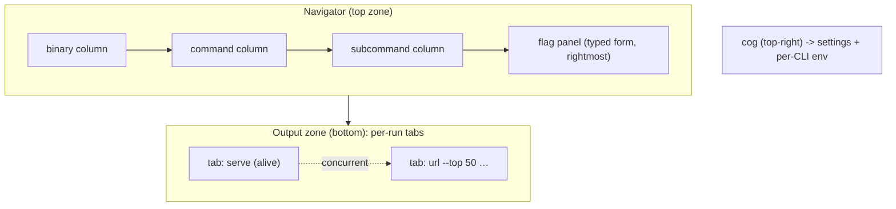

# CLI Explorer - Plan

## Goal Capsule

- **Objective:** Ship a v1 desktop CLI Explorer that wraps `linkedin-jobs` with a macOS Finder-style column navigator, a typed flag form, and terminal-like per-run tabs — built generically on a cobra adapter so `kubectl`, `gh`, `docker`, and other cobra CLIs work without rework.
- **Product authority:** This Product Contract; planning added by `ce-plan`. Implementation belongs to `ce-work`.
- **Open blockers:** None.
- **Product Contract preservation:** Scope unchanged. Precision fixes from research only — command count is ~23 leaves across 4 groups (`profile`/`config`/`auth`/root), not 18; only `serve` is blocking (`watch` is a one-shot poll that exits). No R-IDs changed.
- **Lives as a sibling repo to** `linkedin-job-cli`; it wraps the already-built binary (and any cobra binary), it does not modify CLI source.

---

## Product Contract

### Summary

A generic desktop **CLI Explorer** (Electron, sibling repo) that lays out any cobra CLI as macOS-style columns — binary → command → subcommand, discovered recursively — with the selected command's flags as a typed form on the right. Running a command opens a terminal-like tab (concurrent tabs so blocking commands don't block others) showing the assembled command string and its live output. Column 1 starts empty with an "Add a command" control; a top-right cog opens settings including per-CLI env vars.

### Problem Frame

`linkedin-jobs` is flag-heavy: `url`, `recommended`, `search`, and `hr` each take a handful of flags (`--top`, `--min-salary`, `--remote`, `--no-llm`, `--json`) plus long URL arguments. Running these repeatedly from the shell means recalling and retyping flags, and every new cobra CLI in a developer's toolbelt (`kubectl`, `gh`, `docker`) repeats the same cost. No shipped tool closes this gap: existing CLI→GUI options are either terminal-only (`charmbracelet/fang`), source-level decorators (Gooey, Python only), one-off LLM-generated HTML, or hand-built per-CLI Electron wrappers. None wraps an arbitrary external binary, auto-discovers its command tree, and presents it in a macOS column view. The macOS Finder column view (Miller columns) has not been applied to a CLI command tree in any shipped product.

### Key Decisions

- **Generic CLI Explorer, not a `linkedin-jobs`-specific GUI.** Reusable across the cobra ecosystem; costs more code than a single-purpose UI but matches the column-1-as-picker model and amortizes across `kubectl`/`gh`/`docker`.
- **Cobra-precise discovery now, pluggable adapter interface for later.** `pflag`'s typed flags yield reliable typed form fields (bool/int/string) for free; non-cobra CLI families wait for their own adapters.
- **Build and run, with terminal-like per-run tabs.** The app both assembles the command string and executes it; each run is a concurrent tab so a blocking command (`serve`) doesn't block other work.
- **Output as a tabbed zone beneath the navigator, not a rightmost column.** Wide output (tables, JSON) needs width that Miller columns cannot give.
- **Stop the process when its run tab closes.** Closing a tab terminates the process; a detached/keep-alive mode is a possible later addition, not a v1 behavior.

### Requirements

**Navigation & discovery**

- R1. The app presents wrapped CLIs as macOS Finder-style columns: each column is one level of the command tree (binary → command → subcommand), drilled recursively.
- R2. Command and subcommand discovery is recursive via the cobra adapter, walking the target CLI's help tree; hidden commands are excluded.
- R3. Discovery is pluggable: a cobra adapter ships in v1, and the adapter interface allows other CLI families (clap, click, argparse) to be added without rework.
- R4. Selecting a leaf command renders that command's flags in the rightmost panel.

**Flag form**

- R5. Flags render as typed inputs derived from the adapter's type information: boolean → checkbox, integer → number, other → text.
- R6. Each flag shows its name, the adapter-provided help text as a label or placeholder, and any default value.
- R7. The flag panel exposes a Run control and a Copy control (copies the assembled command string).

**Execution & output**

- R8. Run spawns the target binary with the assembled arguments and streams `stdout` and `stderr` live.
- R9. Each Run opens its own tab in the output zone (terminal-like); multiple tabs run concurrently so a blocking command does not block other commands.
- R10. Each run tab shows the assembled command string alongside its live output.
- R11. A blocking run stays alive in its tab until the user stops or closes it; the tab provides a stop control.
- R12. Output defaults to plain text in v1; rich/table/JSON rendering is out of scope for v1.

**Settings & configuration**

- R13. A settings panel opens from a top-right cog icon.
- R14. Settings include per-CLI environment-variable configuration (e.g. `LJ_COOKIES_FILE`, `OPENAI_API_KEY`), applied to runs of that CLI.

**Onboarding**

- R15. Column 1 starts empty with an "Add a command" control offering known CLIs (`linkedin-jobs`, `gh`, `docker`, `kubectl`) plus add-by-path.

### Layout

### Key Flows

- F1. Add a CLI
  - **Trigger:** Empty column 1, or cog → add.
  - **Steps:** Pick a known CLI or add-by-path → the adapter introspects its command tree → the CLI appears in column 1.
  - **Outcome:** The CLI is selectable and navigable. **Covers R2, R15.**
- F2. Navigate and run
  - **Trigger:** User wants to run a command.
  - **Steps:** Pick binary → command → subcommand → fill flags → Run.
  - **Outcome:** A run tab opens, streams output, and shows the assembled command. **Covers R1, R4, R5, R7, R8, R9, R10.**
- F3. Run while a command blocks
  - **Trigger:** A run tab is still active (e.g. `serve`).
  - **Steps:** Open a new run tab → run another command.
  - **Outcome:** Both run independently; the blocking tab keeps serving. **Covers R9, R11.**

### Acceptance Examples

- AE1. **Covers R9, R11.** Given `linkedin-jobs serve` is running and still active in a tab, when the user opens a new tab and runs `linkedin-jobs url …`, then both run concurrently and `serve` keeps serving.
- AE2. **Covers R5.** Given the `url` command exposes `--remote` (bool) and `--top` (int), when rendered, then `--remote` is a checkbox and `--top` is a number input.
- AE3. **Covers R15.** Given no CLIs are added, when the app opens, then column 1 shows an "Add a command" control and no further empty columns.
- AE4. **Covers R14.** Given `OPENAI_API_KEY` is unset and `recommended` needs it for scoring, when the user sets it in settings → env for `linkedin-jobs` and runs `recommended`, then scoring runs instead of being skipped.

### Success Criteria

- Navigating `linkedin-jobs` exposes all ~23 leaf commands across 4 groups and their real flags, cross-checked against `cmd/*.go`.
- Running `linkedin-jobs url "<url>" --top 50 --min-salary 200k --remote` from the GUI produces identical output to the shell.
- `serve` runs in a background tab while another command runs concurrently in a second tab.
- A bool flag renders as a checkbox and an int flag as a number input (not free text), proving typed discovery works end-to-end.

### Scope Boundaries

**Deferred for later**

- PATH auto-scan + bulk import of discovered CLIs (stretch goal; v1 uses explicit add).
- Non-cobra adapters (clap/click/argparse) — interface ready, adapters not shipped in v1.
- Rich output rendering (tables, syntax highlighting, JSON-aware views) — v1 is plain text.

**Outside this product's identity**

- Not a terminal emulator or shell replacement (no free-form command typing, no pipelines, no shell features).
- Not a CLI authoring or scaffolding tool.
- Not a TUI — desktop GUI only.

### Dependencies / Assumptions

- Sibling to `linkedin-job-cli`; wraps its already-built binary (and any cobra binary) resolved via PATH or a configured path.
- Relies on cobra/pflag typed, structured flags for reliable form generation. Verified for `linkedin-job-cli`: `go.mod` requires `github.com/spf13/cobra` v1.9.1 + `pflag`, and `cmd/*.go` registers flags via `IntVar`/`BoolVar`/`StringVar`.
- Assumes the user provides required env vars (cookies, LLM keys) through the settings panel for commands that need them.
- Electron with a web renderer; the specific UI stack is a planning decision.

### Outstanding Questions

**Resolve before planning**

- None.

**Deferred to planning** — all resolved by the Planning Contract below

- Discovery mechanism → KTD-4 (parse `--help` now; opt-in introspection protocol later).
- UI stack, state, IPC → KTD-1, KTD-2, KTD-3.
- Richer flag widgets → KTD-5 (stringSlice/tag input in v1; enum/file-picker deferred).
- Packaging → KTD-11 (electron-builder, macOS first).

Open implementation-time unknowns (resolve during `ce-work`): exact ANSI-rendering library; whether `watch`'s single-run output should auto-close its tab; notarization identity.

### Sources / Research

- Existing CLI→GUI tools surveyed; none covers this product's combination. Closest matches: `charmbracelet/fang` (TUI, integrates at Go source level, styles help — not desktop, not binary-wrapping, not column-view); Gooey (Python `argparse` source decorator); the "feed `--help` to an LLM" one-off HTML technique; and hand-built per-CLI Electron wrappers. The macOS Finder column view (Miller columns) has not been applied to a CLI command tree in any shipped tool.
- `linkedin-job-cli` uses cobra v1.9.1 + `pflag` (`go.mod`); its command flags are typed via `IntVar`/`BoolVar`/`StringVar` across `cmd/*.go` (e.g. `cmd/url.go`, `cmd/recommended.go`), which is what makes reliable typed form generation possible.
- Command inventory (full read of every `cmd/*.go`): ~23 leaf commands across 4 groups (`profile`/`config`/`auth`/root), recursion depth exactly 3. Adapter quirks to tolerate — one `stringSlice` flag (`query --exclude`, repeatable); two stdin-requiring commands (`profile resume` reads stdin, `config llm` is an interactive wizard); flags embedded in a `Use` string (`score --all [--local]`, so name = first token only); the only shorthands are `export -f/-o`; persistent flags `--db` and `--json` on every command; `serve` is the only truly blocking command (`watch` is a one-shot poll). Cobra's default `--help` format is stable and parseable.
