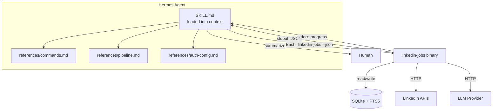

# Publish linkedin-jobs Hermes Skill

## Goal Capsule

- **Objective:** Create a Hermes skill that wraps the linkedin-jobs CLI, enabling the Hermes agent to invoke every CLI capability on the user's behalf — fetching jobs, managing stored jobs, enrichment/scoring, HR outreach, profile/config, and the serve web UI.
- **Authority:** User-confirmed scope (repo source + symlink install, productivity category).
- **Execution profile:** Code — markdown skill files + justfile install target.
- **Stop conditions:** Skill is installed, Hermes discovers it, agent can invoke representative commands across all command groups.
- **Tail ownership:** Implementer owns the detail of reference file organization; the plan defines the file list and content scope per file.

---

## Product Contract

### Summary

The linkedin-jobs CLI is a Go binary with ~22 commands covering LinkedIn job fetching (authenticated and anonymous), SQLite storage with FTS5, LLM-based enrichment and fit scoring, HR outreach research, profile management, and a local web UI. The CLI is already agent-native — every read command supports `--json`.

The user wants a Hermes skill that teaches the Hermes agent when and how to invoke this CLI. The skill is authored in the linkedin-job-cli repo (versioned with the CLI) and installed via a justfile symlink target to `~/.hermes/skills/productivity/linkedin-jobs/`, matching the printing-press precedent.

### Problem Frame

The Hermes agent has Bash tool access but no knowledge of the linkedin-jobs CLI's command surface, prerequisites, or operational hazards. Without a skill, the agent would need to discover commands via `--help` each time, miss auth prerequisites, and lack judgment on when to use `recommended` vs `search` vs `url`, or when to confirm before destructive operations. The skill bridges this gap by loading command knowledge, workflow recipes, and safety gates into the agent's context.

### Requirements

**Skill coverage**

- R1. The skill must document all CLI commands: `recommended`, `search`, `url`, `watch`, `job`, `list`, `show`, `query`, `stats`, `count`, `export`, `tag`, `purge`, `enrich`, `rescore-all`, `hr`, `profile`, `config`, `doctor`, `auth`, `serve`, `version`, and `header-tags`.
- R2. The skill must provide a command decision map: which command to use based on user intent (fetch new jobs, search stored jobs, find a contact, manage profile, etc.).
- R3. The skill must document workflow recipes — named scenarios mapping to concrete command sequences (e.g., "pull my feed and show top matches," "find who to reach out to for a job," "export my pipeline").

**Prerequisites and safety**

- R4. The skill must document prerequisites: binary on PATH, auth (cookies for `recommended`/`url`), LLM config (optional, needed for scoring), profile (`RESUME.md` + `settings.yaml`).
- R5. The skill must instruct the agent to run `auth status` and `doctor` before first use and branch to anonymous commands (`search`, `hr`) when no session is available.
- R6. The skill must enforce approval gates: `purge` (confirm + prior `export`/`count`), `enrich --all` / `rescore-all` (report scope, confirm before bulk LLM cost), `tag applied` (confirm — real-world commitment), `profile clear` (confirm — data loss).
- R7. The skill must instruct the agent to never read, echo, or transmit `LJ_COOKIE` or the cookies file — rely solely on `auth status` for session checks.

**Agent-native output**

- R8. The skill must instruct the agent to use `--json` for all read commands and summarize results for the human, never dump raw JSON.

**Format and install**

- R9. The skill must follow the Hermes SKILL.md format: frontmatter (`name`, `description` ≤1024 chars, `version`, `author`, `license`, `platforms`, `metadata.hermes.tags`), body structure (Overview → When to Use → body → Common Pitfalls → Verification Checklist), total file ≤100k chars aiming for 8-15k.
- R10. The skill must be installable via `just install-skill` which symlinks `~/.hermes/skills/productivity/linkedin-jobs` to the repo's `hermes-skill/` directory, and uninstallable via `just uninstall-skill`.

### Scope Boundaries

**In scope:**

- Authoring `hermes-skill/SKILL.md` and `hermes-skill/references/` files
- Adding `install-skill` / `uninstall-skill` justfile targets
- Documenting the skill in README

**Deferred to follow-up work:**

- Streaming-progress consumption for long ops (the CLI prints progress to stderr; the skill documents this but does not prescribe a polling mechanism)
- Resumable/cancellable bulk ops (the CLI's dedup makes re-runs safe; no explicit resume mechanism exists)
- Scheduled/autonomous runs via Hermes cron

**Outside this product's identity:**

- Modifying the linkedin-jobs CLI itself
- Building an MCP server wrapper (the skill wraps the CLI via Bash, not MCP)
- Publishing to a remote skill registry/hub

---

## Planning Contract

### Key Technical Decisions

- **KTD1. Skill source in repo, symlink install.** The skill files live in `hermes-skill/` in the linkedin-job-cli repo and are installed via symlink to `~/.hermes/skills/productivity/linkedin-jobs/`. This versioning with the CLI ensures the skill tracks command changes, and matches the printing-press symlink precedent (`~/.hermes/skills/printing-press -> ../../.agents/skills/printing-press`).

- **KTD2. SKILL.md + references/ split.** SKILL.md stays in the 8-15k char range (per `hermes-agent-skill-authoring` guidance) with the high-level command map, triggers, prereqs, recipes, and pitfalls. Detailed flag references, pipeline internals, and auth/config documentation go in `references/` subdirectory files that SKILL.md points to. Rationale: keeps the always-loaded skill context lean; detail is progressively disclosed only when the agent needs it.

- **KTD3. Agent-native output contract — `--json` first.** The skill instructs the agent to always pass `--json` on read commands. The agent parses the JSON and summarizes for the human — never dumps raw JSON. The CLI already supports `--json` on every read command (`recommended`, `search`, `url`, `watch`, `job`, `list`, `show`, `query`, `stats`, `count`, `export`, `hr`, `tag`, `enrich`, `config show`, `auth status`, `version`).

- **KTD4. Approval gates proportional to risk.** Destructive (`purge`), costly (`enrich --all`, `rescore-all` — unbounded LLM token spend), real-world-commitment (`tag applied`), and data-loss (`profile clear`) operations require explicit user confirmation. The skill documents the gate for each. `purge` additionally requires a prior `export` or `count` snapshot so the user has a recovery path.

- **KTD5. Category: productivity.** The skill installs under `~/.hermes/skills/productivity/linkedin-jobs/`. The `career-networking` skill (the closest peer) lives in `productivity/`; job search is a productivity workflow.

- **KTD6. `serve` is human-facing, not agent data source.** The agent may start `serve` detached on explicit user request and report the localhost URL. The agent must never scrape the serve HTML as its own data source — it uses the CLI `--json` commands instead. Rationale: `serve` is a browser UI for the human; the agent has direct CLI access.

- **KTD7. Shared workspace — SQLite DB.** Agent and human operate on the same SQLite store. The agent resolves the DB path via `config path` rather than hardcoding, respecting `--db` and `LJ_DB_PATH` overrides. Pipeline status (`tag`) is the agent↔human protocol — the agent never holds job status only in conversation memory. The agent avoids mutations (`tag`, `purge`, `rescore-all`) while `serve` or another bulk op is running to avoid SQLite write contention.

### High-Level Technical Design

The skill is a pure documentation layer — it teaches the agent which CLI command to invoke, with what flags, and how to interpret the output. No code runs inside the skill itself; the agent uses its existing Bash tool to invoke the `linkedin-jobs` binary.

### Assumptions

- The `linkedin-jobs` binary is built and on `PATH` (or the skill's prereq section instructs the agent to run `just build` first).
- Hermes loads skills from `~/.hermes/skills/<category>/<name>/SKILL.md` via symlink (confirmed by the printing-press precedent and the `hermes-agent-skill-authoring` skill documentation).
- The Hermes skill loader initializes at session start — a new session is needed to discover a newly installed skill (documented in `hermes-agent-skill-authoring`).

---

## Implementation Units

### U1. SKILL.md — core skill document

- **Goal:** Create the main skill file that teaches the Hermes agent when and how to invoke the linkedin-jobs CLI.
- **Requirements:** R1, R2, R3, R4, R5, R6, R7, R8, R9
- **Dependencies:** None (U2 provides detail SKILL.md points to, but SKILL.md is written first and references are filled in next).
- **Files:**
  - `hermes-skill/SKILL.md` (create)
- **Approach:**
  Follow the peer-matched structure from `hermes-agent-skill-authoring`. The frontmatter uses `name: linkedin-jobs`, a trigger-focused `description` (≤1024 chars), `version: 0.1.0`, `author`, `license: MIT`, `platforms: [linux, macos, windows]`, and `metadata.hermes.tags: [job-search, linkedin, career, fit-scoring, hr-outreach]`.
  The body contains:
  - **Overview** — one paragraph: what the CLI does and that the skill wraps it.
  - **When to Use** — trigger bullets: user wants to search/browse LinkedIn jobs, score fit, find who to reach out to, manage a job pipeline, configure profile/scoring.
  - **Prerequisites** — binary on PATH (run `linkedin-jobs version` to verify; if missing, run `just build` in the repo), auth check (`auth status`), LLM check (`doctor`), profile check (`config path` + `profile show`). Run these before any domain command on first use.
  - **Command Map** — a table grouping commands by intent (Fetch, Store/Query, Enrich/Score, HR Outreach, Profile, Config, Web UI), with one-line purpose and auth requirement (authenticated / anonymous / either) per command. Key flags per command. Points to `references/commands.md` for full flag detail.
  - **Approval Gates** — the four gate categories from KTD4: destructive (`purge`), costly (`enrich --all`, `rescore-all`), real-world (`tag applied`), data-loss (`profile clear`). Each gate: what to check, what to confirm, what to offer first.
  - **Workflow Recipes** — named scenarios with concrete command sequences:
    1. "Pull my feed" → `auth status` → `recommended --json --remote --min-salary 200k` → summarize top-N by fit score → offer to `tag` strong matches `saved`.
    2. "Search anonymous" → `search "Staff Engineer" Toronto --json --top 25` → summarize.
    3. "Score a URL" → `url "<url>" --json` → summarize.
    4. "What's new" → `watch "Staff Engineer" Toronto --json` → summarize new jobs.
    5. "Find who to reach out to" → `hr "<job-url>" --json` → present best contact + ranked list + hook.
    6. "My best-fit shortlist" → `list --json --sort-score --min-score 70` → summarize.
    7. "Export my pipeline" → `export --format csv -o jobs.csv` → report file path.
    8. "Start the web UI" → `serve --port 8080 &` → report localhost URL (human-facing; agent does not scrape).
  - **Common Pitfalls** — login-gated commands (`recommended`, `url` need cookies; `search`, `hr` work anonymous), salary gate semantics (`--min-salary` drops jobs with no salary data), pre-score gate vs profile knobs (gate drops, knobs cap), `serve` is human-facing, avoid mutations during `serve`/bulk ops (SQLite write contention), never echo cookies, `--json` first (never dump raw JSON to user), long ops print progress to stderr (agent should relay progress, not block silently).
  - **Verification Checklist** — binary on PATH, `auth status` passes, `doctor` clean, skill discoverable in new Hermes session.
  Keep SKILL.md in the 8-15k char range. Push full flag lists, pipeline internals, and env-var tables to U2 reference files.
- **Patterns to follow:** `~/.hermes/skills/productivity/career-networking/SKILL.md` (peer skill, same category), `~/.hermes/skills/software-development/hermes-agent-skill-authoring/SKILL.md` (format and validation rules).
- **Test scenarios:**
  - **Happy path:** SKILL.md frontmatter parses as valid YAML with `name`, `description` (≤1024 chars), `version`, `author`, `license`, `platforms`, `metadata.hermes.tags` — all present.
  - **Happy path:** SKILL.md body starts with `# Title` and contains all required sections: Overview, When to Use, Prerequisites, Command Map, Approval Gates, Workflow Recipes, Common Pitfalls, Verification Checklist.
  - **Edge case:** SKILL.md total size is ≤15k chars (peer range); if it exceeds 20k, content must be pushed to `references/`.
  - **Coverage:** every CLI command from R1 appears in the Command Map with its auth requirement.
  - **Coverage:** at least one workflow recipe covers each command group (fetch, store/query, enrich, HR, profile, config, serve).
  - **Safety:** the Approval Gates section covers all four gate categories (purge, bulk LLM, tag applied, profile clear).
  - **Safety:** the Common Pitfalls section covers: login-gated commands, salary-gate no-data drop, pre-score gate vs profile knobs, serve is human-facing, never echo cookies, --json first.
- **Verification:** SKILL.md passes the Hermes frontmatter validator (starts with `---`, closes with `\n---\n`, `name` + `description` present, description ≤1024 chars, non-empty body, total ≤100k chars). The file is at `hermes-skill/SKILL.md`.

### U2. Reference files — detailed command and pipeline documentation

- **Goal:** Create the reference files that SKILL.md points to for detailed command flags, pipeline internals, and auth/config documentation.
- **Requirements:** R1, R4, R10
- **Dependencies:** U1 (SKILL.md references these files by path).
- **Files:**
  - `hermes-skill/references/commands.md` (create)
  - `hermes-skill/references/pipeline.md` (create)
  - `hermes-skill/references/auth-config.md` (create)
- **Approach:**
  Three reference files, each progressively disclosed from SKILL.md:
  - **`commands.md`** — full command reference. One section per command with: synopsis, all flags (name, type, default, description), auth requirement (authenticated/anonymous/either), `--json` support (yes/no), and a concrete example. Commands grouped by intent (Fetch, Store/Query, Enrich/Score, HR, Profile, Config, Web UI). Include global flags (`--db`, `--json`). Source: `cmd/*.go` flag definitions + README.
  - **`pipeline.md`** — the scoring pipeline: fetch → detail fetch (stderr progress `N/total`) → pre-score gate (drops pre-store, zero LLM tokens) → persist all survivors → dedup (content-hash, skips scoring) → hard filter (profile knobs, caps score, no LLM) → LLM enrich+score (one call per genuine new candidate) → display. Document the pre-score gate vs profile knobs distinction (gate drops, knobs cap; table from README). Document the scoring rubric weights from `settings.yaml`. Document `--no-score`, `--force-overwrite`, `rescore-all` semantics. Source: `cmd/pipeline.go`, README.
  - **`auth-config.md`** — auth model (cookies via `LJ_COOKIES_FILE`/`LJ_COOKIE` for `recommended`/`url`; anonymous for `search`/`hr`; CSRF derived from `JSESSIONID`), LLM config (resolution order: `LJ_LLM_*`/`OPENAI_API_KEY` → `ANTHROPIC_API_KEY` → opencode discovery; `LJ_LLM_BASE_URL`, `LJ_LLM_MODEL`), settings.yaml structure (stats, filter, scoring, enrich, profile sections), RESUME.md, env var table (all vars from README), `config show`/`config path`/`doctor` usage. Source: README, `internal/config/`, `settings.yaml`.
- **Patterns to follow:** `~/.hermes/skills/productivity/career-networking/references/` (peer skill reference structure).
- **Test scenarios:**
  - **Happy path:** `commands.md` covers every command from R1 with its flags, auth requirement, and `--json` support.
  - **Happy path:** `pipeline.md` describes the full pipeline in order: fetch → detail → gate → persist → dedup → hard filter → enrich+score → display.
  - **Happy path:** `auth-config.md` covers all env vars from the README configuration table.
  - **Edge case:** each reference file is self-contained — a reader can understand the topic from the file alone without needing to read the others.
  - **Integration:** SKILL.md's references to `references/commands.md`, `references/pipeline.md`, `references/auth-config.md` resolve to actual files with matching names.
- **Verification:** All three files exist under `hermes-skill/references/`. SKILL.md's cross-references resolve. Content is accurate against the CLI's current command surface (spot-check 3+ commands against `cmd/*.go` flag definitions).

### U3. Install mechanism — justfile target + README documentation

- **Goal:** Add `install-skill` and `uninstall-skill` justfile targets that symlink the skill into Hermes's skills directory, and document the process in README.
- **Requirements:** R10
- **Dependencies:** U1, U2 (installs the complete skill directory).
- **Files:**
  - `justfile` (modify — add two targets)
  - `README.md` (modify — add "Hermes Skill" section)
- **Approach:**
  Add to `justfile`:
  - `install-skill` — creates the directory `~/.hermes/skills/productivity/` if needed, then symlinks `~/.hermes/skills/productivity/linkedin-jobs` to the repo's `hermes-skill/` directory. Idempotent: if the symlink already exists, report it and skip; if a broken symlink exists, remove and recreate.
  - `uninstall-skill` — removes the symlink at `~/.hermes/skills/productivity/linkedin-jobs` if it exists.
  Add to `README.md` a "Hermes Skill" section after "Install": explains that the CLI ships with a Hermes skill wrapper, how to install it (`just install-skill`), that a new Hermes session is needed to discover the skill, and what the skill does (wraps the CLI so the Hermes agent can invoke it).
- **Patterns to follow:** Existing `justfile` target style (bash scripts with `set -euo pipefail`). The printing-press symlink pattern (`~/.hermes/skills/printing-press -> ../../.agents/skills/printing-press`).
- **Test scenarios:**
  - **Happy path:** `just install-skill` creates a symlink at `~/.hermes/skills/productivity/linkedin-jobs` pointing to the repo's `hermes-skill/` directory.
  - **Happy path:** `just uninstall-skill` removes the symlink.
  - **Edge case:** running `just install-skill` twice — second run is idempotent (reports existing symlink, does not error).
  - **Edge case:** a broken symlink already exists at the target path — `install-skill` removes it and recreates.
  - **Integration:** after `just install-skill`, the skill directory contains `SKILL.md` and `references/` accessible through the symlink path.
- **Verification:** `just install-skill` succeeds, `readlink ~/.hermes/skills/productivity/linkedin-jobs` points to the repo's `hermes-skill/` directory, `just uninstall-skill` removes it. README "Hermes Skill" section documents the install and discovery process.

---

## Verification Contract

| Gate | Command / check | Applies to |
|------|----------------|------------|
| Frontmatter valid | YAML parses, `name` + `description` present, description ≤1024 chars, body non-empty, total ≤100k chars | U1 |
| Size in peer range | `wc -c hermes-skill/SKILL.md` is ≤15k chars (warn if >20k) | U1 |
| Command coverage | Every command from R1 appears in SKILL.md Command Map | U1 |
| References resolve | `references/commands.md`, `references/pipeline.md`, `references/auth-config.md` all exist | U1, U2 |
| Install works | `just install-skill` creates symlink; `readlink` confirms target | U3 |
| Uninstall works | `just uninstall-skill` removes symlink | U3 |
| README updated | `README.md` contains "Hermes Skill" section | U3 |

No automated test suite applies — the deliverable is markdown documentation and a justfile target. Verification is structural (frontmatter validation, file existence, symlink resolution) and behavioral (skill discoverable in a new Hermes session).

---

## Definition of Done

- `hermes-skill/SKILL.md` exists with valid Hermes frontmatter and all body sections (Overview, When to Use, Prerequisites, Command Map, Approval Gates, Workflow Recipes, Common Pitfalls, Verification Checklist).
- `hermes-skill/references/commands.md`, `hermes-skill/references/pipeline.md`, `hermes-skill/references/auth-config.md` all exist and are accurate against the CLI's current command surface.
- `justfile` has `install-skill` and `uninstall-skill` targets that work (create/remove the symlink).
- `README.md` has a "Hermes Skill" section documenting installation.
- After `just install-skill`, the skill is discoverable in a new Hermes session (verify via `skill_view` or by starting a new session and checking skill availability).
- All 22+ CLI commands are covered in the Command Map and `references/commands.md`.
- Approval gates for `purge`, `enrich --all`, `rescore-all`, `tag applied`, and `profile clear` are documented in SKILL.md.
- No absolute paths in any skill file — all paths are relative or use `~` for home directory references in the justfile.
