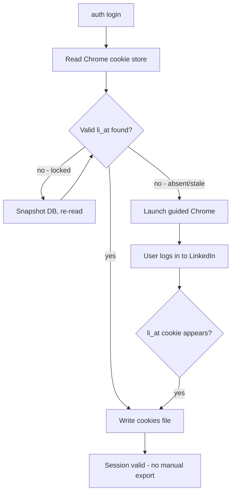
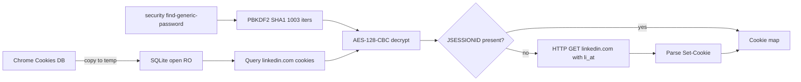

# Browser Auth Login - Plan

## Goal Capsule

- **Objective:** Acquire a valid LinkedIn session through a browser-based flow so users never manually export cookies. Running `linkedin-jobs auth login` yields a session that passes `auth status` with no DevTools or cookie-extension step.
- **Product authority:** Product Contract from ce-brainstorm (preserved unchanged — see note below). Implementation decisions, units, and verification added by ce-plan.
- **Execution profile:** code — four implementation units, macOS-gated, adds chromedp + x/crypto dependencies.
- **Open blockers:** None. All brainstorm deferred questions resolved during planning (see Planning Contract KTDs).
- **Tail ownership:** ce-work or a human implementer consumes units U1–U4 in dependency order.

---

## Product Contract

*Product Contract unchanged from ce-brainstorm. No R/A/F/AE-IDs modified. Deferred Outstanding Questions resolved in Planning Contract KTDs.*

### Summary

A new `auth login` command reads LinkedIn cookies silently from the local Chrome cookie store as its first attempt, falling back to a guided browser login (chromedp, headed, managed profile) only when the silent read fails. The captured session writes to the existing cookies file so `recommended`, `url`, and `auth status` consume it unchanged. The current `LJ_COOKIE` / `LJ_COOKIES_FILE` env path stays as the highest-priority resolution for headless, agent, and Hermes use.

### Problem Frame

Today's auth requires a manual cookie export — a browser-extension dump or a DevTools → Network → Cookie-header copy — pasted into an env var or file (`internal/auth/auth.go`). This is the single highest-friction onboarding step in the tool, and it repeats every time the LinkedIn session goes stale. The user is almost always already logged into LinkedIn in their normal browser, so that existing session is the natural source — the manual export exists only because nothing bridges the browser's session to the CLI. LinkedIn offers no consumer OAuth for browsing sessions, so the bridge has to be built from browser-side session capture rather than a login API.

### Key Decisions

- **Silent-read first, guided-login fallback.** Reading cookies from the existing Chrome cookie store is both zero-friction and zero-detection-risk on the common path; the guided browser login is the safety net for when the user isn't logged in or the read fails. A browser-only design would pay LinkedIn's anti-bot detection cost on every auth.
- **Chrome-only for v1.** The user is on Chrome and already logged in; broadening to Safari/Firefox is deferred.
- **macOS-only for v1.** Cookie-store encryption and keychain access are platform-specific; other OSes fall back to the existing env/file path unchanged.
- **Explicit `auth login` command.** Browsers never auto-launch mid-`recommended` or any read command — a window opening during a routine fetch would be surprising.
- **Managed persistent profile for the guided flow.** The guided browser uses a dedicated profile the CLI owns, not the user's real Chrome profile, so it never conflicts with a running browser or risks the user's real profile state. The dedicated profile accumulates LinkedIn trust across re-auths.

### Requirements

**Silent cookie-store read**

- R1. `auth login` first attempts to read LinkedIn cookies directly from the local Chrome cookie store, decrypting cookie values via the macOS Keychain.
- R2. When Chrome is running and the cookie database is locked, the reader snapshots the database file before reading rather than failing.

**Guided browser login (fallback)**

- R3. When the silent read returns no valid session, `auth login` launches a headed Chrome (via a Go CDP library) using a managed persistent profile and navigates to LinkedIn.
- R4. The CLI detects login completion by watching for the `li_at` cookie, then captures the full cookie set.
- R5. The user performs all credential entry, two-factor auth, and challenge resolution in the browser window themselves; the CLI never handles or stores a LinkedIn password.

**Session persistence**

- R6. Captured cookies are written to the existing cookies-file location so `recommended`, `url`, and `auth status` consume them with no change to their resolution logic.
- R7. The existing `LJ_COOKIE` / `LJ_COOKIES_FILE` env path remains the highest-priority resolution; browser capture is additive and never overrides an explicit env override.

**Platform support**

- R8. On non-macOS or non-Chrome setups, `auth login` reports that browser capture is unsupported and points the user to the env/file method.

### Key Flows

- F1. Happy-path silent read
  - **Trigger:** User runs `auth login` while logged into LinkedIn in Chrome.
  - **Actors:** The CLI user.
  - **Steps:** Read Chrome cookie DB → decrypt via Keychain → extract `li_at` and `JSESSIONID` → validate → write cookies file.
  - **Outcome:** Session valid; no browser window ever opens.
- F2. Guided-login fallback
  - **Trigger:** Silent read finds no valid session (not logged in, or read failed after snapshot).
  - **Actors:** The CLI user.
  - **Steps:** Launch headed Chrome with managed profile → navigate to LinkedIn → wait for `li_at` cookie to appear → capture full cookie set → close browser → write cookies file.
  - **Outcome:** Session valid after the user completes login in the window.
  - **Covered by:** R3, R4, R5, R6.

### Acceptance Examples

- AE1. **Silent read success.** Given Chrome holds valid LinkedIn cookies, when the user runs `auth login`, then no browser opens and `auth status` reports a valid session.
- AE2. **Silent read with Chrome running.** Given Chrome is open (DB locked), when the user runs `auth login`, then the CLI snapshots the DB and still succeeds without launching a browser.
- AE3. **Guided fallback.** Given the silent read finds no valid session, when the user runs `auth login`, then a Chrome window opens to LinkedIn login; after the user logs in the window closes and `auth status` reports a valid session.
- AE4. **Unsupported platform.** Given a non-macOS host, when the user runs `auth login`, then the CLI prints an unsupported message and points to the env/file method.

### Success Criteria

- `linkedin-jobs auth login` produces a session that passes `auth status`, with zero manual cookie export or DevTools steps.
- On a host already logged into LinkedIn in Chrome, the silent path succeeds without launching a browser.
- After capture, `recommended` and `url` work against the freshly captured session with no env var set.

### Scope Boundaries

**Deferred for later**

- Safari and Firefox cookie-store support.
- Auto-refresh-on-expiry: detecting a stale session mid-command and re-triggering login automatically.
- Windows and Linux cookie-store reading.

**Outside this product's identity**

- Storing or handling the user's LinkedIn password.
- Consumer OAuth — LinkedIn offers none for browsing sessions.
- Multi-user or shared-secret session management.

### Dependencies / Assumptions

- A net-new dependency on a Go Chrome DevTools Protocol library (chromedp) and on `golang.org/x/crypto/pbkdf2` for cookie decryption. No such dependency exists today (`go.mod`).
- LinkedIn may challenge the managed-profile browser on first guided login (email/SMS verification, "unusual activity"). The guided flow is best-effort; the user resolves challenges in the window, but success is not guaranteed.
- Chrome must be installed for the guided flow; the silent read requires Chrome's cookie DB to exist.

### Sources / Research

- Current auth resolution (env → file) and session validity rules: `internal/auth/auth.go`.
- `auth status` command and its validity messaging: `cmd/auth.go`.
- No existing CDP or browser-cookie dependency: `go.mod`.
- LinkedIn Voyager API session requirement (`li_at` + `JSESSIONID`-derived csrf-token): `internal/auth/auth.go:27`.
- Config home-directory helper (`~/.linkedin-jobs`): `internal/config/settings.go:93`.

---

## Planning Contract

### Key Technical Decisions

- KTD1. **JSESSIONID fetched via HTTP, not from the cookie DB.** Chrome's cookie DB persists `li_at` (long-lived auth token) but usually omits `JSESSIONID` (session-only CSRF token source). The silent read gets `li_at` from the DB, then makes a lightweight HTTP GET to `https://www.linkedin.com/` with `Cookie: li_at=...` and reads the fresh `JSESSIONID` from the `Set-Cookie` response header. This makes the silent read robust on the common path without launching a browser. If the HTTP fetch fails (expired `li_at`), the result is an incomplete session and the flow falls through to the guided login.
- KTD2. **Default cookies file adds a third resolution source.** `auth.Resolve` gains a step after env and explicit-file: a default file at `~/.linkedin-jobs/cookies.txt` (via `config.HomeDir()`). `auth login` writes captured cookies there when `LJ_COOKIES_FILE` is unset; when it is set, `auth login` writes to that path instead. Resolution priority is unchanged for existing users: `LJ_COOKIE` env > `LJ_COOKIES_FILE` env > default file. The new source gets `Source: "login"`.
- KTD3. **chromedp headed + anti-bot hardening + managed profile.** The guided flow launches Chrome via `chromedp.NewExecAllocator` with `chromedp.Flag("headless", false)`, `chromedp.Flag("enable-automation", false)`, `chromedp.Flag("disable-blink-features", "AutomationControlled")`, and `chromedp.UserDataDir(~/.linkedin-jobs/chrome-profile)`. Headed mode and the anti-bot flags reduce LinkedIn's automation detection; the persistent profile accumulates trust across re-auths. Cookie capture uses `network.GetAllCookies().Do(ctx)` because `li_at` is `HttpOnly` and invisible to `document.cookie`.
- KTD4. **macOS-only gate via `runtime.GOOS`.** Both capture mechanisms are darwin-specific (keychain decryption, Chrome cookie DB path). The `auth login` command checks `runtime.GOOS != "darwin"` and prints an unsupported message directing the user to the env/file method (R8). The Chrome cookie-store and guided-login packages compile on all platforms but their entry functions return a clear error on non-darwin.
- KTD5. **Keychain access via `security` shell-out.** The Chrome "Safe Storage" passphrase is retrieved with `security find-generic-password -w -s "Chrome Safe Storage" -a "Chrome"`. This triggers a one-time macOS Keychain authorization prompt; after the user clicks "Always Allow" subsequent calls are silent. No cgo keychain binding needed.
- KTD6. **Cookie DB read via copy-to-temp + existing `modernc.org/sqlite`.** Chrome holds a lock on the Cookies file while running. The reader copies the DB plus its `-wal` / `-shm` sidecars to a temp dir, then opens the copy read-only with the existing `modernc.org/sqlite` driver (already in `go.mod`). This avoids lock errors and WAL staleness without a new SQLite dependency.
- KTD7. **Guided flow always launches its own Chrome.** It does not reuse an already-running Chrome instance via remote debugging port. A managed profile is locked to one Chrome process; reusing the user's running Chrome would require their real profile (scope-excluded) or a debug-port connection that adds fragility. Simpler to launch, capture, and quit.

### High-Level Technical Design

The feature adds three new files under `internal/auth/` and modifies two existing files. The data shape flowing between components is a `map[string]string` of cookie name → value; both capture mechanisms produce this map, and the command layer assembles it into the raw `Cookie:` header string that `auth.Resolve` and `linkedin.Client` already consume.

**Silent-read decrypt pipeline:**

**Resolution order (unchanged for existing users):**

1. `LJ_COOKIE` env (raw header) → `Source: "env"`
2. `LJ_COOKIES_FILE` env (path) → `Source: "file"`
3. `~/.linkedin-jobs/cookies.txt` (default, written by `auth login`) → `Source: "login"`

**New dependencies:** `github.com/chromedp/chromedp`, `github.com/chromedp/cdproto` (network, cdp), `golang.org/x/crypto` (pbkdf2). Existing `modernc.org/sqlite` reused for the cookie DB read.

### Assumptions

- The user has Chrome installed at the standard macOS path (`/Applications/Google Chrome.app/Contents/MacOS/Google Chrome`); chromedp auto-detects this.
- Chrome's cookie encryption scheme (AES-128-CBC, PBKDF2 with `saltysalt`/1003 iterations, v10/v11 prefix) remains current. Chrome 130+ adds a SHA256(host_key) prefix in DB version 24+, which the decryptor strips.
- The macOS Keychain prompt succeeds (user clicks Allow/Always Allow). If denied, the silent read fails gracefully and falls through to the guided login.

### Sequencing

U1 (foundation) is a prerequisite for U4. U2 and U3 are independent of each other and can be implemented in parallel. U4 depends on all three. Recommended order: U1 → U2 + U3 (parallel) → U4.

---

## Implementation Units

### U1. Cookie assembly helpers + default cookies path in Resolve

- **Goal:** Shared foundation — assemble a cookie map into a raw header, write it to the cookies file, and add the default cookies-file step to `auth.Resolve` so captured sessions are discoverable without env vars.
- **Covers:** R6, R7.
- **Files:**
  - `internal/auth/auth.go` (modify) — add `AssembleCookieHeader`, `DefaultCookiesPath`, `WriteCookiesFile`; add default-file step to `Resolve`.
  - `internal/auth/auth_test.go` (modify) — tests for new functions and resolution priority.
- **Approach:**
  - `AssembleCookieHeader(cookies map[string]string) string` joins entries as `name=value` separated by `; `, deterministic order (sort keys for stable output).
  - `DefaultCookiesPath() string` returns `filepath.Join(config.HomeDir(), "cookies.txt")`.
  - `WriteCookiesFile(path, header string) error` writes the header with `0600` permissions, creating parent dir if needed.
  - `Resolve` gains a third step after the existing env and file checks: if `DefaultCookiesPath()` exists and is readable, resolve from it with `Source: "login"`. The existing `readCookiesFile` helper handles the read.
- **Test scenarios:**
  - `AssembleCookieHeader` produces `li_at=abc; JSESSIONID=ajax:1` from a two-entry map (sorted).
  - `WriteCookiesFile` + `readCookiesFile` round-trips a header.
  - `Resolve` with only the default file present (no env vars) returns `Source: "login"`.
  - `Resolve` priority: `LJ_COOKIE` env wins over `LJ_COOKIES_FILE` wins over default file.
  - `Resolve` returns `ErrNoSession` when none of the three sources exist.
- **Verification:** `go test ./internal/auth/ -run 'AssembleCookieHeader|WriteCookiesFile|Resolve'`
- **Dependencies:** None.

### U2. Chrome cookie-store reader (silent read)

- **Goal:** Read `li_at` and other persistent LinkedIn cookies from Chrome's encrypted cookie DB, decrypt them, fetch `JSESSIONID` via HTTP when absent, and return a cookie map.
- **Covers:** R1, R2.
- **Files:**
  - `internal/auth/chromestore.go` (new) — `ReadChromeCookies() (map[string]string, error)` and internal helpers.
  - `internal/auth/chromestore_test.go` (new) — decrypt + key-derivation + HTTP-fetch tests.
- **Approach:**
  - Cookie DB path: `~/Library/Application Support/Google/Chrome/Default/Network/Cookies` (fall back to the pre-Chrome-96 path without `Network/` if not found).
  - Copy the DB file plus `-wal`/`-shm` sidecars to a temp dir; open the copy read-only via `modernc.org/sqlite`.
  - Read `meta.version` for the DB format version (≥24 triggers SHA256 prefix stripping).
  - Keychain passphrase via `exec.Command("security", "find-generic-password", "-w", "-s", "Chrome Safe Storage", "-a", "Chrome")`.
  - Derive AES key: `pbkdf2.Key(pass, []byte("saltysalt"), 1003, 16, sha1.New)`.
  - For each `linkedin.com` cookie row: if `encrypted_value` starts with `v10`/`v11`, strip the 3-byte prefix, AES-128-CBC decrypt with IV of 16 spaces (`0x20`), PKCS7 unpad, strip the 32-byte SHA256 host prefix if DB version ≥24. Otherwise use the plaintext `value` column.
  - Query: `SELECT name, encrypted_value, value, host_key FROM cookies WHERE host_key LIKE '%linkedin.com'`.
  - If `JSESSIONID` is absent from the result map (session-only, common), fetch it: HTTP GET `https://www.linkedin.com/` with header `Cookie: li_at=<value>`, parse `Set-Cookie: JSESSIONID="ajax:..."` from the response.
  - Return the map of name→value for all LinkedIn cookies found.
  - On non-darwin, return an error immediately (`runtime.GOOS != "darwin"`).
- **Test scenarios:**
  - PBKDF2 key derivation: known passphrase + `saltysalt`/1003/16 → expected 16-byte key (test vector with hardcoded expected output).
  - Decrypt: a synthetic `v10`-prefixed AES-128-CBC blob encrypted with a known key → expected plaintext after unpad. Test both with and without the v24 SHA256 prefix.
  - Decrypt unencrypted fallback: a row whose `value` column is non-empty and `encrypted_value` is empty → returns the plaintext value unchanged.
  - JSESSIONID HTTP fetch: `httptest.Server` returning `Set-Cookie: JSESSIONID="ajax:test123"; Path=/; HttpOnly` → parser extracts `ajax:test123`.
  - Cookie filtering: a SQLite fixture DB (built in-test with `modernc.org/sqlite`) containing two `linkedin.com` rows and one `example.com` row → only LinkedIn cookies returned.
  - Non-darwin: function returns `ErrUnsupportedPlatform` (test via build-constrained stub or runtime check).
- **Verification:** `go test ./internal/auth/ -run 'Chrome|Decrypt|PBKDF2|JSESSIONID'`
- **Dependencies:** U1 (conceptual — returns the map that U1 assembles, though U2 itself does not call U1 functions). New deps: `golang.org/x/crypto/pbkdf2`, existing `modernc.org/sqlite`.

### U3. Guided browser login (chromedp fallback)

- **Goal:** Launch a headed Chrome with a managed persistent profile, let the user log in to LinkedIn, detect login by watching for `li_at`, and return all LinkedIn cookies as a map.
- **Covers:** R3, R4, R5.
- **Files:**
  - `internal/auth/browserlogin.go` (new) — `LoginViaBrowser(profileDir string, timeout time.Duration) (map[string]string, error)`.
  - `internal/auth/browserlogin_test.go` (new) — cookie-filtering unit test; guided flow is integration-level (manual).
- **Approach:**
  - Allocator options: `chromedp.DefaultExecAllocatorOptions` + `chromedp.Flag("headless", false)` + `chromedp.Flag("enable-automation", false)` + `chromedp.Flag("disable-blink-features", "AutomationControlled")` + `chromedp.UserDataDir(profileDir)`.
  - `chromedp.Navigate("https://www.linkedin.com/login")`.
  - Poll loop inside a `chromedp.ActionFunc`: every 2 seconds call `network.GetAllCookies().Do(ctx)`, scan for a cookie named `li_at` with a non-empty value. Stop when found or when the timeout (default 5 minutes) elapses.
  - On detection: filter the returned `[]*network.Cookie` to `linkedin.com` domain cookies, build `map[string]string`, return.
  - `defer cancel()` on the chromedp context closes the browser.
  - On non-darwin, return `ErrUnsupportedPlatform`.
  - If Chrome is not installed, chromedp returns a launch error; wrap it with a message telling the user to install Chrome.
- **Test scenarios:**
  - Cookie filtering: a mock `[]*network.Cookie` containing `.linkedin.com`, `.www.linkedin.com`, and `.example.com` entries → only LinkedIn-domain cookies appear in the output map.
  - Profile dir creation: verify `MkdirAll(profileDir)` succeeds before launch.
  - Guided flow end-to-end: manual verification only (requires real Chrome + LinkedIn credentials). Document the manual test steps in the test file as a `// Manual:` comment block.
- **Verification:** `go test ./internal/auth/ -run 'FilterCookies|BrowserLogin'`
- **Dependencies:** New deps: `github.com/chromedp/chromedp`, `github.com/chromedp/cdproto/network`. U1 for profile-dir path convention.

### U4. `auth login` command

- **Goal:** Wire the orchestration — macOS gate, silent-read attempt, guided-login fallback, persistence, and user-facing status messages.
- **Covers:** R1–R8 (orchestration of all requirements).
- **Files:**
  - `cmd/auth.go` (modify) — add `authLoginCmd` subcommand; register under `authCmd`.
- **Approach:**
  - New cobra subcommand `linkedin-jobs auth login`.
  - Guard: if `runtime.GOOS != "darwin"`, print "browser capture is only supported on macOS; set LJ_COOKIES_FILE or LJ_COOKIE" and return (R8).
  - Determine write path: `LJ_COOKIES_FILE` env if set, else `auth.DefaultCookiesPath()`.
  - Step 1 — silent read: call `auth.ReadChromeCookies()`. If it returns a map containing `li_at`, assemble the header via `auth.AssembleCookieHeader`, validate with `auth.Session.Valid()` logic, and if valid write to the path and print success. No browser launched.
  - Step 2 — guided fallback: if silent read fails, returns no `li_at`, or the assembled session is invalid, call `auth.LoginViaBrowser(filepath.Join(config.HomeDir(), "chrome-profile"), 5*time.Minute)`. On success assemble, write, print success.
  - Step 3 — failure: if both paths fail, print a clear error and point to the manual env/file method.
  - Update `auth status` messaging to mention `auth login` as the easy path when no session is found (the existing `ErrAuthRequired` message in `client.go:41` already references `auth login`).
- **Test scenarios:**
  - Non-macOS gate: with a build-tag stub or injected GOOS check, verify the unsupported message prints.
  - Orchestration: inject mock `ReadChromeCookies` and `LoginViaBrowser` funcvars (package-level variables that the test overrides) — silent-read success skips browser; silent-read failure triggers browser; both-failure prints error.
  - Write-path selection: `LJ_COOKIES_FILE` set → writes there; unset → writes to `DefaultCookiesPath()`.
  - End-to-end: manual — run `linkedin-jobs auth login` on macOS with Chrome logged into LinkedIn (silent path) and with Chrome logged out (guided path).
- **Verification:** `go test ./cmd/ -run 'AuthLogin'` + manual `just build && linkedin-jobs auth login`
- **Dependencies:** U1, U2, U3.

---

## Verification Contract

| Check | Command | Applies to | Done signal |
|---|---|---|---|
| Unit tests (auth) | `go test ./internal/auth/` | U1, U2, U3 | All pass; decrypt + PBKDF2 + filtering + assembly + Resolve tests green |
| Unit tests (cmd) | `go test ./cmd/ -run Auth` | U4 | Orchestration + non-macOS gate pass |
| Full test suite | `go test ./...` | All | No regressions in existing auth/config tests |
| Build | `just build` | All | Binary builds with new chromedp + x/crypto deps |
| Vet | `go vet ./...` | All | No issues |
| Manual: silent read | `linkedin-jobs auth login` then `auth status` | U2, U4 | On macOS with Chrome logged in: no browser opens, status passes |
| Manual: guided fallback | clear LinkedIn from Chrome, `linkedin-jobs auth login` | U3, U4 | Browser opens, after login closes, status passes |
| Manual: end-to-end | `linkedin-jobs recommended --top 3` after login | U1–U4 | Feed fetches using the captured session with no env vars set |

**Testing constraints:** chromedp integration tests require a real Chrome binary and cannot run in CI without a display. The guided-login path (U3) is verified manually; its unit tests cover only the pure filtering logic. The Chrome cookie decrypt (U2) is fully unit-testable with synthetic encrypted blobs and a fixture SQLite DB — no keychain prompt needed when the key is injected. The keychain `security` shell-out itself is macOS-only and tested via manual verification only.

---

## Definition of Done

**Global**

- All four units implemented and committed.
- `go test ./...` passes with no regressions.
- `just build` produces a working binary.
- `go vet ./...` is clean.
- `go.mod` and `go.sum` updated with chromedp, cdproto, and `golang.org/x/crypto`.
- README `## Auth` section updated to document `auth login` as the primary path, with the env/file method as the fallback for headless/agent use.
- Manual verification on macOS: silent-read path and guided-fallback path both produce a valid session.

**Per-unit**

- U1: `Resolve` finds the default cookies file; assembly + write round-trip in tests.
- U2: decrypt test vectors pass; fixture-DB read returns LinkedIn cookies; JSESSIONID HTTP fetch works against a test server.
- U3: cookie filtering test passes; manual guided login captures a valid session.
- U4: orchestration tests pass; non-macOS gate works; manual `auth login` → `auth status` → `recommended` flow works end-to-end.

**Cleanup**

- No dead-end or experimental code left in the diff (e.g. abandoned read-only-in-place DB approach, unused keyring library if tried and abandoned).
- No debug logging or temporary profile dirs left behind.
