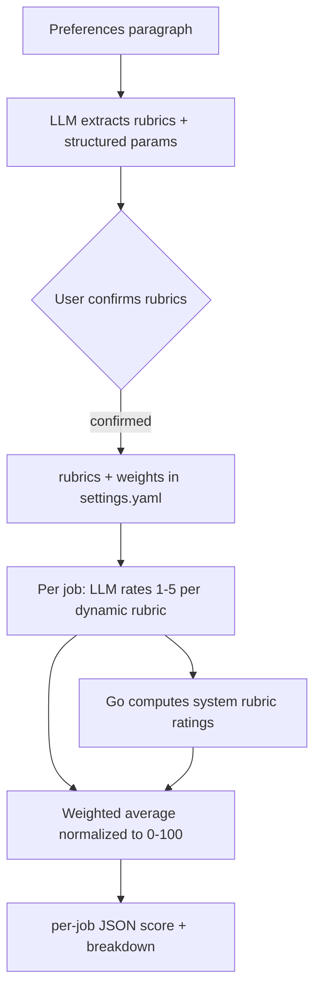

# Dynamic Rubric Scoring - Plan

## Goal Capsule

**Objective.** Replace the fixed 6-dimension rubric scorer with a dynamic rubric system: the user writes a preferences paragraph, an LLM extracts the rubrics, and each job is scored by per-rubric 1–5 ratings combined into one normalized 0–100 weighted average. Backward compatibility is explicitly out of scope.

**Product authority.** Owner: patrickpu. Source: in-session brainstorm 2026-07-15.

**Open blockers.** None blocking start. The LLM's per-rubric rating consistency and paragraph-extraction quality are accepted assumptions that need validation during planning; the system degrades gracefully because the user confirms rubrics before save.

---

## Product Contract

**Product Contract preservation.** Unchanged. The four deferred-to-planning questions are resolved below in Key Technical Decisions (scoring curve, JSON shape, prompt assembly, system-default set) without rewriting any requirement, scope boundary, or acceptance example.

### Summary

A rubric system where the user writes one preferences paragraph and the LLM extracts the rubrics (plus a few system defaults that always apply). Each job scores via an LLM 1–5 rating per rubric combined into a normalized 0–100 weighted average, with no hard caps. Rubrics and their 1–10 weights live in `settings.yaml`; per-job scores are loose JSON in SQLite. Setup is paragraph-in / rubrics-out; `reset` wipes and starts clean; `amend` surgically changes only the rubrics named.

### Problem Frame

The current scorer has six hardcoded dimensions (`internal/score/score.go`): salary, tech overlap, startup stage, AI intensity, compensation extras, and work arrangement. Each dimension has hand-coded tier logic, a typed weight field, a dedicated DB column for its extracted signal, and a fixed slot in the enrichment prompt. Adding a new criterion today — say "free snacks" or "on-call rotation" — requires code changes in five places: a new column, new tier logic, a new weight key, a new prompt field, and a new settings entry. The user's preferences don't fit a fixed schema.

The prior system (`docs/plans/2026-06-30-001-feat-rubric-scoring-plan.md`) deliberately kept the LLM out of scoring because LLMs collapse scores to midpoints (0/50/75). That discipline bought reproducibility at the cost of flexibility: only six axes, none of them arbitrary. This refactor reverses that trade — it accepts non-deterministic LLM ratings to gain rubrics the user can define in plain language.

### Key Decisions

**KD1 — The LLM rates each rubric 1–5; Go composes the score.** For dynamic rubrics the LLM extracts a 1–5 rating per job (boolean-like rubrics like "free snacks" land at 1 or 5; gradated ones like "AI intensity" spread across the range). System rubrics keep their proven deterministic logic, re-expressed to emit a 1–5 rating. Go maps ratings to weighted points. This accepts non-deterministic scoring in exchange for arbitrary rubrics; the prior calibration discipline is deliberately relaxed.

**KD2 — Weighted-average normalized to 0–100, with no hard caps.** The final score is the weight-normalized average of all rubric ratings mapped to 0–100, stable regardless of how many rubrics exist. This retires the baseline-and-cap band semantics: the old "60 = cleared hard filter" baseline and the deal-breaker (30) / hard-filter (50–60) caps are all gone. A job rated 4/5 across all rubrics scores ~80 whether there are 3 rubrics or 15.

**KD3 — System defaults coexist with dynamic rubrics.** Salary, location, and work arrangement always apply as system rubrics (the dimensions with proven logic and structured inputs); other current dimensions with proven logic can stay as system defaults too. Dynamic rubrics generated from the paragraph extend them. All rubrics feed the same weighted average uniformly.

**KD4 — Array-valued rubrics.** Related items collapse into one rubric rather than one rubric per item: "preferred tech: Java, Python" is a single rubric; "avoided tech: C#, Ruby on Rails" is a single rubric. The rating reflects match across the whole list, keeping the rubric set compact and the weighted average meaningful.

**KD5 — The paragraph replaces the question-by-question setup.** The LLM extracts both the rubrics and the structured inputs system rubrics need (salary floor as a number, locations, preferred/avoided tech). When the paragraph omits a required number, the user is prompted for it interactively rather than guessed at.

### Requirements

**Setup & rubric lifecycle**

- R1. Rubrics are generated from a free-text preferences paragraph via the LLM, replacing the question-by-question setup flow.
- R2. A set of system/default rubrics always applies; the rest are LLM-generated from the paragraph.
- R3. Extracted rubrics are presented to the user for confirmation before being saved.
- R4. A rubric may carry an array of items rather than one rubric per item; its rating reflects aggregate match across the list.
- R5. The setup paragraph also yields the structured inputs system rubrics need; a required number absent from the paragraph is prompted for interactively.
- R6. `reset` forgets all rubrics and restarts setup clean.
- R7. `amend` takes a follow-up paragraph and only creates or changes the rubrics named in it; rubrics not mentioned are left untouched.

**Scoring model**

- R8. Each job is scored per rubric with a 1–5 rating — LLM-extracted for dynamic rubrics, Go-computed for system rubrics.
- R9. The final fit score is a weight-normalized average of all rubric ratings mapped to 0–100, so the number of rubrics does not distort the score distribution.
- R10. All rubric weights default to 5 and are adjustable from 1 to 10 in `settings.yaml`.
- R11. There are no hard caps; negative preferences (including former deal-breaker tech) work purely through low ratings on weighted rubrics.

**Data & config**

- R12. All rubrics — system and dynamic — and their weights are stored in `settings.yaml`.
- R13. Per-job rubric scores are stored as a loose JSON structure in SQLite, replacing the per-rubric columns.

### Key Flows

- F1. Initial setup
  - **Trigger:** User runs setup (or first run with no rubrics).
  - **Steps:** User writes a preferences paragraph → LLM extracts rubrics plus structured params → rubrics presented for confirmation → user confirms or edits → saved to `settings.yaml`; any missing required number is prompted.
- F2. Amend
  - **Trigger:** User runs `amend` with a follow-up paragraph.
  - **Steps:** LLM proposes new or changed rubrics from the paragraph → only named rubrics are created or updated, all others preserved → saved.
- F3. Reset
  - **Trigger:** User runs `reset`.
  - **Steps:** All rubrics are wiped → setup flow restarts clean from a new paragraph.
- F4. Per-job scoring
  - **Trigger:** A job is enriched/scored.
  - **Steps:** LLM rates the job 1–5 per dynamic rubric; system rubric ratings are computed in Go → weighted average → 0–100 score → stored as JSON alongside the breakdown.

### Acceptance Examples

- AE1. **Amend is surgical.**
  - **Covers R7.**
  - **Given** an existing rubric set including salary, tech, and remote.
  - **When** the user amends with "add a free-snacks rubric and set salary weight to 8".
  - **Then** the free-snacks rubric is added, the salary weight becomes 8, and every other rubric and weight is unchanged.
- AE2. **Missing number is prompted.**
  - **Covers R5.**
  - **Given** a paragraph that says "I want a high salary" with no floor.
  - **When** setup extracts the rubrics.
  - **Then** the user is interactively prompted for the salary floor rather than the LLM guessing one.
- AE3. **Scale stability.**
  - **Covers R9.**
  - **Given** a job rated 4/5 on every rubric.
  - **Then** its score is ~80 whether the rubric set has 3 rubrics or 15.
- AE4. **Negative preference via rating, not a cap.**
  - **Covers R11.**
  - **Given** a job whose stack contains an avoided tech (e.g. C#).
  - **When** scored.
  - **Then** it gets a low rating on the avoided-tech rubric, lowering the weighted score, with no hard cap applied.

### Success Criteria

- Scores reflect the user's stated priorities — adding or removing a rubric measurably shifts job rankings.
- The rubric count does not distort the score distribution (R9).
- `amend` never silently drops or alters an unmentioned rubric (R7).

### Scope Boundaries

**Deferred for later.**

- Learned / Bayesian weighting from accept-reject history.
- Multi-profile support (one user, one rubric set).
- Real-time re-scoring on rubric or weight edit (still requires an explicit re-score invocation).

**Outside this product's identity.**

- Backward compatibility and migration of existing scored rows. Existing rows are simply re-scored on the next run; no migration tooling.

### Dependencies / Assumptions

- **Assumption.** The LLM can extract a coherent rubric set plus the structured params (salary floor, locations, preferred/avoided tech) from a free-text paragraph. Quality is untested but degrades gracefully because the user confirms rubrics before save.
- **Assumption.** The LLM's 1–5 per-rubric ratings are consistent enough across jobs to be comparable. Calibration variance is accepted as the cost of arbitrary rubrics.
- **Assumption.** The LLM can rate arbitrary rubrics from a job description; a signal absent from the posting yields a low rating rather than an error.
- **Dependency.** The existing re-score pipeline remains the recalibration mechanism — editing weights and re-scoring requires no code changes.

### Outstanding Questions

All four deferred-to-planning questions are resolved by the Key Technical Decisions below: scoring curve (KTD1), per-job JSON shape (KTD2), dynamic prompt assembly (KTD4), and the system-default set (KTD5).

### Sources / Research

- Grounding dossier (verbatim quote-sheet from the repo): `/tmp/compound-engineering/ce-brainstorm/rubric-refactor/grounding.md`.
- Prior, now-superseded plan for the fixed scorer this replaces: `docs/plans/2026-06-30-001-feat-rubric-scoring-plan.md`.
- Current scorer: `internal/score/score.go` (6 dimensions, `Weights` struct, `Compute`).
- Per-rubric DB columns + migration: `internal/store/store.go`.
- Settings shape: `internal/config/settings.go` (`ScoringSettings`, `ScoringWeights`).
- Fixed enrichment prompt: `internal/llm/scorer.go` (`enrichPromptTmpl`).
- Question-by-question setup: `cmd/setup.go`; profile loader: `internal/profile/profile.go`.

---

## Planning Contract

**Implementation-detail dossier** (verified signatures/shapes with `file:line` pointers): `/tmp/compound-engineering/ce-plan/rubric-refactor/impl-detail.md`.

### Key Technical Decisions

**KTD1 — Scoring curve: weighted average mapped via rating/5 × 100.** The final score is `score = (Σ wᵢ·rᵢ / Σ wᵢ) / 5 × 100`, where `rᵢ ∈ [1,5]` and `wᵢ ∈ [1,10]`. Rating 1 → 20, 3 → 60, 5 → 100; a job rated 4/5 across all rubrics scores 80 (satisfies AE3) regardless of rubric count. This means a job that fails every rubric still floors at 20 (below the old 30 deal-breaker cap), communicating "junk" without a hard pin. Resolves OQ-1.

**KTD2 — Per-job scores live in one `rubric_scores` JSON column.** A new `rubric_scores TEXT` column on `jobs` holds a JSON array of `{id, kind, rating, weight, reason}` plus a top-level `score`. The existing `fit_score` (computed 0–100) and `fit_reason` (rendered breakdown) columns are reused as-is for ranking and display. The dedicated scorer-feeding columns — `has_bonus`, `has_equity`, `has_retirement_match`, `ai_intensity`, `score_cap_reason` — are no longer read or written (left as ignored dead columns; SQLite column-drop is disproportionate to the value). This is the "loose JSON in SQLite" requirement (R13). Resolves OQ-2.

**KTD3 — System-default set is exactly {salary, work_arrangement, location}; all four other current dimensions become dynamic.** salary, work_arrangement, and location are the only dimensions computable deterministically from data already present (parsed salary, location/remote_type) with no dedicated extraction column. tech_overlap, startup, ai_intensity, and compensation_extras become ordinary dynamic rubrics the LLM rates 1–5 — this is required for ai_intensity/compensation_extras (their inputs `ai_intensity`, `has_*` columns are being removed) and is applied to tech_overlap/startup too for consistency, which also retires the `preferred_tech` list-matching logic. A user who writes "I care about AI intensity and tech fit" gets those as dynamic rubrics automatically. Resolves OQ-4 — and is the most notable planning bet; surfaced for review at handoff.

**KTD4 — The enrichment prompt is assembled at call time from the active rubric set.** A fixed fact-extraction block (the display-purpose fields: tech_stack, company_stage, seniority, etc.) is followed by a dynamic block that lists each active dynamic rubric (id + description + array items, e.g. "avoid: C#, Ruby on Rails") and asks for a 1–5 rating each. The LLM returns the facts plus a `{rubric_id: rating}` map. Ratings outside 1–5 are clamped; a missing rubric in the response defaults to 3 (neutral) with a warning. The `ErrEmptyDescription` invariant is preserved: an empty description must not stamp `enriched_at`/`scored_at`, or the dedup gate hides the job from retries. Resolves OQ-3.

**KTD5 — `settings.yaml` gains a `scoring.rubrics` list; the `profile:` block is now populated by the paragraph.** The `scoring.weights` map, `baseline`, and `deal_breaker_cap` keys are removed; replaced by `scoring.rubrics: [{id, kind, weight, description, items}]`. The three system rubrics are written on setup with default weights; their weights are user-tunable like any rubric (R10, R12). The structured params (salary floor, locations, work arrangement, tech lists) flow into the existing `profile:` block, now extracted from the paragraph rather than prompted one-by-one. `reason_threshold` is retained for `fit_reason` display gating.

**KTD6 — Every job is enriched and scored; the hard-filter token-frugality gate is retired.** The user said to use the LLM freely. `internal/filter`'s `PassesHardFilter` gate is removed from the ingest path — all jobs run through enrich → compute → persist. The `status=filtered` path and `--include-filtered` flag become dead; they can be left as no-ops or cleaned up. This removes the cap-and-hide behavior outright (R11).

### Architecture notes

- The single enrichment call surface is `llm.Chat(p, system, user, maxTokens, temperature)` (`internal/llm/chat.go:19`); `llm.Enrich` (`internal/llm/scorer.go:54`) is the only scorer-side caller and is the natural place to add the ratings map to its return.
- `enrichAndScoreJob(st, j, prof, provider, weights)` at `cmd/pipeline.go:187` is the one chokepoint for enrich → persist → score → persist, shared by `ingest` (`pipeline.go:128`), `cmd/enrich.go:68`, and `cmd/rescore_all.go:59`. Rewriting it re-points the whole pipeline.
- **SearchFTS column-drift trap:** any column change must be mirrored in three list sites and two inline FTS projections — `schema` (`store.go:15-57`), `addColumns` (`69-94`), `jobCols` (`682-687`), the inline `SearchFTS` projection (`535-540`), and `scanJob` (`693-764`). Missing any one silently breaks search at runtime; `TestSearchFTS_Parity` (`store_test.go:103`) is the regression guard.
- New cobra commands register via `rootCmd.AddCommand` in a per-file `init()` (`cmd/root.go:47-51`); `amend` and `reset` follow the same one-file-per-command convention.

---

## Implementation Units

### U1. Data model & migration: `rubric_scores` JSON column

- **Goal.** Replace the dedicated scorer columns with a single loose-JSON column; keep the migration idempotent and FTS-safe.
- **Files.** `internal/models/job.go`, `internal/store/store.go`, `internal/store/store_test.go`.
- **Patterns.** Remove `HasBonus`, `HasEquity`, `HasRetirementMatch`, `AIIntensity`, `ScoreCapReason` from `JobPosting` (`job.go:48-61`); add `RubricScores string`. Append `{"rubric_scores", "TEXT"}` to `addColumns` (`store.go:69-94`) and the `CREATE TABLE` schema (`15-57`); extend `jobCols` (`682-687`), both FTS projections (`535-540`, `686-687`), and `scanJob` (`693-764`) in lockstep. Update `SetEnrichmentAndScore` (`313`) to stop writing the removed fields; update `SetScore` (`354`) signature to accept the rubric-scores JSON (drop the cap-reason arg).
- **Test scenarios.** `TestMigrate_AddsRubricScoresColumn` (legacy schema → column present); `TestSearchFTS_Parity` stays green (the regression guard — must pass unchanged); `TestSetScore_PersistsRubricScores` (round-trip JSON); `TestUpsert_PreservesRubricScores`; `TestScanJob_ReadsRubricScores`.

### U2. Settings model: rubric list replaces fixed weights

- **Goal.** Express the rubric set (system + dynamic) and weights in `settings.yaml`; load/validate it.
- **Files.** `internal/config/settings.go`, `internal/config/settings_test.go`.
- **Patterns.** Replace `ScoringWeights` (`settings.go:45-52`) and the dimension fields of `ScoringSettings` (`36-41`) with a `Rubric` struct (`ID, Kind, Weight, Description, Items []string`) and `ScoringSettings.Rubrics []Rubric`. Remove `Baseline`, `DealBreakerCap`, `Weights`. `DefaultSettings()` injects the three system rubrics (salary, work_arrangement, location) at weight 5. Validation: each `Weight` clamped to `[1,10]`; invalid → 5. Update the YAML template (`160-170`).
- **Test scenarios.** `TestDefaultSettings_InjectsSystemRubrics`; `TestLoad_RubricsFromYAML`; `TestLoad_WeightClampedToRange`; `TestLoad_EmptyRubricsFallsBackToDefaults`.

### U3. Scoring engine: weighted-average normalized scorer

- **Goal.** Re-implement `Compute` as a weighted-average composer over a rubric set; re-express the three system rubrics as 1–5 producers.
- **Files.** `internal/score/score.go`, `internal/score/score_test.go`.
- **Patterns.** Replace the `Weights` struct (`score.go:67-76`) and `FromSettings` (`52-63`) with `func Compute(job *models.JobPosting, profile *models.Profile, rubrics []config.Rubric, dynamicRatings map[string]int) Result`. For system rubrics, compute the rating internally: salary (ratio to floor → 1–5), work_arrangement (matches preferred → 5, else 1, partial for hybrid), location (in preferred → 5, same region → 3, else 1). For dynamic rubrics, read `dynamicRatings[id]` (default 3 if absent). Compose via KTD1. `FitReason` renders the per-rubric ratings. Delete all cap logic and constants (`CapDealBreakerTech`, `capHardFilter*`, etc.).
- **Test scenarios.** `TestCompute_WeightedAverage` (known ratings → expected score); `TestCompute_ScaleStability` (3 vs 15 rubrics, same ratings → same score, covers AE3); `TestCompute_SalaryRating` (at floor / +30% / under floor tiers); `TestCompute_WorkArrangementRating`; `TestCompute_LocationRating`; `TestCompute_MissingDynamicRatingDefaultsNeutral`; `TestCompute_NoCaps` (avoided-tech present does not pin, covers AE4); `TestFitReason_RendersRatings`.

### U4. Enrichment: rubric-driven prompt + rating extraction

- **Goal.** Make the enrichment prompt dynamic over the active rubric set; parse a per-rubric ratings map from the response.
- **Files.** `internal/llm/scorer.go`, `internal/llm/scorer_test.go`.
- **Patterns.** Generalize `enrichPromptTmpl` (`scorer.go:15-38`): keep the fact-extraction block for display fields; append a dynamic block built from `rubrics` listing each dynamic rubric and requesting a 1–5 rating. Extend the response struct (`enrichJSON`, `96-112`) with a `Ratings map[string]int`. `Enrich` (`54`) returns the enrichment plus the ratings map. Clamp ratings to `[1,5]` via the existing `normalizeEnum`-style helper (`161-168`). Preserve the `ErrEmptyDescription` (`45`) non-stamping invariant and the `parseDelimiter` (`202`) fallback for the new ratings block. Reuse `fakeCompletions` in tests.
- **Test scenarios.** `TestEnrich_ReturnsRatings` (fake LLM returns ratings map); `TestEnrich_ClampsOutOfRangeRatings`; `TestEnrich_MissingRubricRatingDefaults`; `TestEnrich_EmptyDescriptionNoTimestamp` (invariant); `TestEnrich_DelimiterFallbackParsesRatings`.

### U5. Pipeline: wire enrich → compute → persist JSON

- **Goal.** Re-point the shared helper to the new enrich + compute + JSON-persist flow; always enrich.
- **Files.** `cmd/pipeline.go`, `cmd/enrich.go`, `cmd/rescore_all.go`, `cmd/pipeline_test.go`, `cmd/enrich_test.go`.
- **Patterns.** Rewrite `enrichAndScoreJob` (`pipeline.go:187`): signature drops `weights score.Weights`, takes `rubrics []config.Rubric`; call `llm.Enrich` → `score.Compute(job, prof, rubrics, ratings)` → persist via updated `SetScore` (writes `fit_score`, `fit_reason`, `rubric_scores`). Remove the `PassesHardFilter` gate from `ingest` (`128`) — every job enriches (KTD6). Update the three call sites (`128`, `enrich.go:68`, `rescore_all.go:59`).
- **Test scenarios.** `TestEnrichAndScoreJob_PersistsWeightedScore` (fake LLM → computed score + JSON, end-to-end); `TestIngest_AlwaysEnriches` (no skip path); `TestRescoreAll_UsesCurrentRubrics`.

### U6. Setup: paragraph → rubrics + structured params

- **Goal.** Replace the question-by-question flow with paragraph-in / rubrics-out, with confirmation and missing-number prompting.
- **Files.** `cmd/setup.go`, new `internal/llm/rubricgen.go` (or extend `scorer.go`), `cmd/setup_test.go`.
- **Patterns.** Replace `runSetup`'s prompts (`setup.go:53-75`) with: read a paragraph → an LLM call extracts dynamic rubrics (`[{id, description, items}]`) plus structured params (salary floor, locations, work arrangement, preferred/avoided tech) → merge with the three system defaults → print the rubric list for confirmation → for any required number absent from the paragraph (e.g. salary floor), prompt via the existing `promptFloatPtr` helper → write `scoring.rubrics` and the `profile:` block to `settings.yaml`. Uses `llm.Chat` (`chat.go:19`).
- **Test scenarios.** `TestSetup_ExtractsRubricsFromParagraph`; `TestSetup_PromptsForMissingSalary` (covers AE2); `TestSetup_ConfirmationBeforeSave`; `TestSetup_WritesSystemDefaults`.

### U7. Amend & reset commands

- **Goal.** Add `amend` (surgical, additive) and `reset` (wipe + restart) commands.
- **Files.** new `cmd/amend.go`, new `cmd/reset.go`, `cmd/root.go` (register both via `init()`), `cmd/amend_test.go`, `cmd/reset_test.go`.
- **Patterns.** `amend`: load existing rubrics from `settings.yaml` → take a follow-up paragraph → LLM proposes additions/changes keyed by id → apply only to rubrics whose id or description the paragraph names; preserve every unmentioned rubric and weight (covers AE1) → write back. `reset`: clear `scoring.rubrics` → re-run the setup flow (U6). Both register via `rootCmd.AddCommand`.
- **Test scenarios.** `TestAmend_OnlyTouchesNamedRubrics` (covers AE1); `TestAmend_PreservesWeightsOfUntouched`; `TestReset_ClearsAllRubrics`; `TestReset_RestartsSetup`.

### U8. Render: score breakdown from ratings

- **Goal.** Render the weighted score and per-rubric ratings from the new JSON; retire cap-reason rendering.
- **Files.** `internal/render/render.go`, `internal/render/render_test.go` (if present), `cmd/serve.go` (score caption).
- **Patterns.** Parse `rubric_scores` JSON; render the per-rubric rating list in the detail view (e.g. "salary 4/5 (w8), free_snacks 1/5 (w5)"). Remove cap-reason / "capped at" rendering. `serve` UI: replace the cap badge with the ratings breakdown caption.
- **Test scenarios.** `TestRender_DetailShowsRatings`; `TestRender_NoCapReason`; serve fixture update if it asserts on `data-status="filtered"`.

---

## Test Strategy

- **Unit tests** for `score.Compute` (U3) and the enrichment rating parsing (U4) are the highest-value coverage — the algorithm and the LLM-response contract are fully defined by the scenarios above; develop TDD-style.
- **Integration tests** for the pipeline (U5) using the existing `fakeCompletions` httptest helper verify end-to-end scoring without network calls.
- **Migration test** (U1) follows the existing `store_test.go` legacy-schema pattern; `TestSearchFTS_Parity` (`store_test.go:103`) must stay green — it is the column-drift regression guard.
- **No live LLM calls in tests.** All LLM-touching tests use httptest fakes.
- **Verify with:** `go build ./... && go vet ./... && go test ./...`.
- **Manual smoke test after implementation:** run setup with a paragraph, confirm rubrics land in `settings.yaml`; `recommended` a few jobs and confirm scores land sensibly with a ratings breakdown; `amend` to add a rubric and `score --all` to confirm only the new rubric changed; `reset` and re-setup.

## Migration / Backward Compatibility

- Backward compatibility is explicitly out of scope (Scope Boundaries). Existing DB rows are re-scored on the next `recommended`/`enrich`/`score --all` run.
- The `rubric_scores` column is added via the idempotent `addColumns` mechanism; the removed columns stay as ignored dead columns (no destructive drop).
- The `scoring.weights`/`baseline`/`deal_breaker_cap` keys in an existing `settings.yaml` are ignored once `scoring.rubrics` exists; first run of the new setup writes the rubrics list. Existing `profile:` values are preserved unless the user re-runs setup.
- `status=filtered`, `--include-filtered`, and `score_cap_reason` become vestigial; left as no-ops rather than removed to avoid breaking muscle memory, with a documentation note.

## Risks

- **Risk: LLM rating inconsistency across jobs.** The same job re-scored may rate slightly differently, and two similar jobs may diverge. Mitigation: ratings are coarse (5 buckets) which limits variance; temperature can be set low on the rating call; re-scoring is idempotent enough for ranking. Accepted per KD1.
- **Risk: paragraph extraction produces a poor rubric set.** Mitigation: the user confirms rubrics before save (R3); `amend` corrects misses; `reset` restarts.
- **Risk: making tech_overlap/startup/ai_intensity dynamic loses the deterministic precision** of the current tier logic (KTD3). Mitigation: the LLM rating these is a good fit (judgment calls); if a dimension proves noisy, it can be promoted back to a system rubric later by adding Go rating logic — the architecture supports mixed system/dynamic.
- **Risk: FTS column drift** if the `rubric_scores` column isn't mirrored in both projections. Mitigation: `TestSearchFTS_Parity` catches it; U1 calls out all five sites explicitly.

## Sequencing

U1 → U2 → U3 (parallel with U4) → U5 → U6 → U7 → U8. U3 (the scoring algorithm) and U4 (the prompt/ratings) are the algorithmic heart and can develop test-first in parallel once U1/U2 land the new shapes. U5 wires them into the pipeline. U6/U7 are the user-facing setup/lifecycle. U8 is cosmetic and last.
